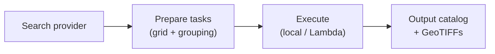

<p align="center">
  
</p>

# AerEO

> **Access, extract, reproject for Earth Observation — locally or remotely, without reinventing the wheel.**

AerEO is a plugin-based satellite data extraction framework. It wires together
the catalog, reading, reprojection, and writing tools you already trust (STAC,
Earthaccess, Satpy, `odc-geo`) behind a single pipeline where every step can be
replaced. The result: analysis-ready GeoTIFFs aligned to the [Major TOM
grid](https://github.com/ESA-PhiLab/Major-TOM), ready for ML or downstream analysis.

<p align="center">
  
</p>

*Sentinel-2 NDWI extracted as Major TOM grid cells. Every job writes an
`artifacts.parquet` catalog where each row is a Major TOM grid cell referencing
the file that was just extracted; the default writer emits GeoTIFFs, but you
can swap in any writer plugin. Because everything is aligned to the same grid,
outputs from different sensors and dates can be merged directly into ML
datasets.*

## Install

The fastest way to get started is to install AerEO with all optional extras:

```bash
uv add "aereo[all]"
# or
pip install "aereo[all]"
```

Sensor-specific search and I/O plugins are separate packages, so you only ship
what you need. For per-sensor install commands and credentials, see
[Install](https://frandorr.github.io/aereo/install/).

## Examples

> **Performance tip:** Run AerEO in the same region as your data source. During
> extraction, data is downloaded from the source catalog; if your runtime is not
> in the same AWS region as the data, downloads can be **very slow**. Being in the
> same region is **HIGHLY recommended** to avoid slow transfers and egress
> charges.

All tutorial notebooks can be opened directly in Google Colab. Each notebook starts with a setup cell that installs AerEO and any sensor-specific plugins it needs.

| Notebook | Sensor(s) | Open in Colab |
|---|---|---|
| [01 — Sentinel-2](examples/01-sentinel2.ipynb) | Sentinel-2 L2A | [](https://colab.research.google.com/github/frandorr/aereo/blob/main/examples/01-sentinel2.ipynb) |
| [01b — Sentinel-2 NDVI](examples/01b-sentinel2-ndvi.ipynb) | Sentinel-2 L2A (NDVI) | [](https://colab.research.google.com/github/frandorr/aereo/blob/main/examples/01b-sentinel2-ndvi.ipynb) |
| [01c — Sentinel-2 NDWI](examples/01c-sentinel2-ndwi.ipynb) | Sentinel-2 L2A (NDWI) | [](https://colab.research.google.com/github/frandorr/aereo/blob/main/examples/01c-sentinel2-ndwi.ipynb) |
| [02 — VIIRS](examples/02-viirs.ipynb) | VIIRS | [](https://colab.research.google.com/github/frandorr/aereo/blob/main/examples/02-viirs.ipynb) |
| [03 — Sentinel-3 OLCI](examples/03-sentinel3.ipynb) | Sentinel-3 OLCI | [](https://colab.research.google.com/github/frandorr/aereo/blob/main/examples/03-sentinel3.ipynb) |
| [03b — Sentinel-3 NDVI](examples/03b-sentinel3-ndvi.ipynb) | Sentinel-3 OLCI (NDVI) | [](https://colab.research.google.com/github/frandorr/aereo/blob/main/examples/03b-sentinel3-ndvi.ipynb) |
| [04 — GeoTessera](examples/04-tessera.ipynb) | GeoTessera | [](https://colab.research.google.com/github/frandorr/aereo/blob/main/examples/04-tessera.ipynb) |
| [05 — GOES-19 ABI](examples/05-goes19.ipynb) | GOES-19 ABI | [](https://colab.research.google.com/github/frandorr/aereo/blob/main/examples/05-goes19.ipynb) |
| [06 — Multiple constellations](examples/06-multiple-constellation.ipynb) | VIIRS + GOES-19 | [](https://colab.research.google.com/github/frandorr/aereo/blob/main/examples/06-multiple-constellation.ipynb) |
| [Step by step raw pipeline](examples/step_by_step_raw.ipynb) | Sentinel-2 (raw API) | [](https://colab.research.google.com/github/frandorr/aereo/blob/main/examples/step_by_step_raw.ipynb) |

> **NASA Earthaccess authentication:** The [VIIRS](examples/02-viirs.ipynb),
> [Sentinel-3 OLCI](examples/03-sentinel3.ipynb), and
> [Sentinel-3 NDVI](examples/03b-sentinel3-ndvi.ipynb) notebooks use
> `earthaccess` to query NASA data. You must configure authentication first.
> The recommended way is to create a `~/.netrc` file — follow the
> [earthaccess authentication guide](https://earthaccess.readthedocs.io/en/latest/user/howto/authenticate/).
> For Google Colab, see [Running NASA notebooks in Colab](#running-nasa-notebooks-in-colab).

### Running NASA notebooks in Colab

The NASA notebooks need a valid `~/.netrc` file. Run this cell once in Colab to create it from your credentials:

```python
import os
from getpass import getpass

# Get Earthdata credentials from the user
earthdata_username = getpass("Earthdata username: ")
earthdata_password = getpass("Earthdata password: ")

# Define the path for the .netrc file in the user's home directory
netrc_path = os.path.expanduser("~/.netrc")

# Create the .netrc file with the provided credentials
with open(netrc_path, "w") as f:
    f.write("machine urs.earthdata.nasa.gov login {username} password {password}\n".format(
        username=earthdata_username,
        password=earthdata_password
    ))

# Set permissions for the .netrc file to be readable only by the owner
os.chmod(netrc_path, 0o600)

print(f"Successfully created {netrc_path} for Earthdata authentication.")
```

## Optional extras

AerEO's core install covers STAC search, ODC-based reprojection, GeoTIFF writing,
and local execution. A few built-in capabilities need extra dependencies:

| Extra | Enables | Install |
|---|---|---|
| `serverless` | `LambdaExecutor` and S3 staging (via `boto3`) | `uv add aereo[serverless]` |
| `swath` | `reproject_swath` / `reproject_pyresample` for 2-D lat/lon swath data | `uv add aereo[swath]` |
| `viz` | Cartopy-backed plots in `aereo.viz` | `uv add aereo[viz]` |
| `pc` | Microsoft Planetary Computer integration | `uv add aereo[pc]` |
| `all` | Everything above in one command | `uv add aereo[all]` |

## Copy/paste example

Save this as `quickstart.py` and run it with `uv run python quickstart.py`:

```python
"""Pure-Python quickstart for AerEO.
To run the full pipeline:

    uv run python examples/quickstart_pure_python.py
"""

from __future__ import annotations

from datetime import datetime, timezone

from shapely.geometry import Polygon

from aereo.builtins import (
    build_grouped_tasks,
    read_odc_stac,
    search_stac,
    write_geotiff,
)
from aereo.executors import LocalExecutor
from aereo.pipeline import ExtractionJob


def main() -> None:
    """Build a job in pure Python and run the extraction pipeline."""
    # Tiny AOI around Chocón reservoir, Argentina.
    aoi = Polygon(
        [
            (-68.90986824592407, -39.23705421799603),
            (-68.65925870907353, -39.23705421799603),
            (-68.65925870907353, -39.41589522092947),
            (-68.90986824592407, -39.41589522092947),
            (-68.90986824592407, -39.23705421799603),
        ]
    )

    job = ExtractionJob(
        name="quickstart",
        grid_dist=10_000,
        output_uri="/tmp/aereo_quickstart",
        search=search_stac,
        read=read_odc_stac,
        write=write_geotiff,
        target_aoi=aoi,
    )

    print("--- ExtractionJob ---")
    print(f"name: {job.name}")
    print(f"output_uri: {job.output_uri}")
    print(f"grid_dist: {job.grid_dist}")

    print("\n--- Search ---")
    assets = job.search(
        stac_api_url="https://earth-search.aws.element84.com/v1",
        collections={"sentinel-2-l2a": ["red", "nir"]},
        intersects=aoi,
        start_datetime=datetime(2024, 1, 1, tzinfo=timezone.utc),
        end_datetime=datetime(2024, 1, 10, tzinfo=timezone.utc),
    )
    print(f"Found {len(assets)} asset rows")

    if assets.empty:
        print("No assets found; nothing to extract.")
        return

    print("\n--- Build tasks ---")
    tasks = job.build_tasks(assets, build_grouped_tasks)
    print(f"Built {len(tasks)} task(s)")

    print("\n--- Extract ---")
    artifacts = job.execute(tasks, executor=LocalExecutor(workers=1))
    print(f"Extracted {len(artifacts)} artifact(s)")

    catalog_uri = job.write_catalog(artifacts)
    print(f"\nCatalog written to: {catalog_uri}")


if __name__ == "__main__":
    main()
```

Open `/tmp/aereo_quickstart` — you have GeoTIFFs on the Major TOM grid. The script also calls `job.write_catalog(artifacts)`, so an `artifacts.parquet` catalog is written next to the GeoTIFFs.

## Configuration with Hydra

For reusable jobs, put YAML configs in a Hydra package and load them with
`ExtractionJob.load_from_config`. This is the same Sentinel-2 job as the
quickstart, expressed as config:

```yaml
# examples/config/job_sentinel2.yaml
target_bands: [red, nir]
aoi_path: config/aoi/chocon.geojson

name: sentinel2_sample
grid_dist: 10_000
grid_cells_margin: 10
target_aoi: ${aoi_path}
output_uri: /tmp/aereo_extraction
overwrite: false

search:
  _target_: aereo.builtins.search_stac
  _partial_: true
  stac_api_url: "https://earth-search.aws.element84.com/v1"
  collections:
    sentinel-2-l2a: ${target_bands}
  intersects: ${aoi_path}
  start_datetime: "2024-01-01T00:00:00Z"
  end_datetime: "2024-01-10T23:59:59Z"

read:
  _partial_: true
  _target_: aereo.builtins.read_odc_stac
write:
  _target_: aereo.builtins.write.write_geotiff
```

Load and override values from Python:

```python
from aereo.pipeline import ExtractionJob

job = ExtractionJob.load_from_config(
    config_dir="examples/config",
    config_name="job_sentinel2",
    overrides=[
        "grid_dist=50_000",
        "search.start_datetime=2024-02-01T00:00:00Z",
    ],
)
```

You can also run configs from the CLI using the example runner:

```bash
uv run python examples/run_job.py config_name=job_sentinel2 grid_dist=50_000
```

The `overrides` use Hydra dot notation, so any field in the YAML can be changed
without editing the file.

## What you get

These outputs come straight from the tutorial notebooks. Every plot shows
grid-aligned patches on the Major TOM grid, with the target AOI overlaid.

### [Sentinel-2 (nir, red)](examples/01-sentinel2.ipynb)


### [Sentinel-2 NDVI](examples/01b-sentinel2-ndvi.ipynb)


### [VIIRS](examples/02-viirs.ipynb)


### VIIRS vs GOES-19 ABI — same grid, different sensors

The same Major TOM grid cells extracted from two very different sensors:

| GOES-19 ABI | VIIRS |
|---|---|
|  |  |

See the full walkthrough in [06 — Multiple constellations](examples/06-multiple-constellation.ipynb).

## How it works



1. **Search** — query a catalog and get a validated `GeoDataFrame[AssetSchema]`.
2. **Prepare** — group assets by time and native CRS into `ExtractionTask`
   objects.
3. **Execute** — run each task through `read → preprocess → reproject →
   postprocess → write`, producing grid-aligned artifacts and a catalog.

Any stage can be replaced by a function you write. Learn how in
[Build a Plugin](https://frandorr.github.io/aereo/plugins/build-a-plugin/).

## Why AerEO?

| Problem | How AerEO solves it |
|---|---|
| Every catalog has a different API | One `job.search(...)` call with swappable search functions. |
| Tiles do not line up across sensors | Built-in Major TOM grid + local UTM patch geoboxes. |
| Reprojection boilerplate | Readers/writers can call `reproject_odc` (or any reprojector) as needed. |
| Mixed-CRS scenes fail | `build_grouped_tasks` groups assets by native CRS. |
| Notebook → production is hard | Same config package runs in Python and AWS Lambda. |
| Plugin frameworks force inheritance | AerEO plugins are `@validate_call` functions + standard entry points. |

## Core concepts

1. **`ExtractionJob`** — a validated bundle of grid size, output URI, AOI, and reader/writer callables.
2. **Search function** — e.g. `search_stac`. Pass it to `job.search(...)` with kwargs.
3. **Task builder function** — e.g. `build_grouped_tasks`. Groups assets into `ExtractionTask` objects.
4. **`ExtractionTask`** — one unit of work: assets + grid patches + stage pipeline.
5. **Stage functions** — `read_odc_stac`, `reproject_odc`, `ndvi`, `write_geotiff`, etc. Passed directly to `ExtractionJob(read=..., write=...)`.
6. **`LocalExecutor`** — runs tasks locally. Swap for `LambdaExecutor` later without changing the pipeline.

## Docs

- [Install](https://frandorr.github.io/aereo/install/) — per-sensor install and credentials
- [Pure Python Quickstart](https://frandorr.github.io/aereo/getting-started/pure-python/) — first extraction in 5 minutes
- [Configuration](https://frandorr.github.io/aereo/configuration/config-package/) — Hydra config package and YAML schema
- [Tutorials](https://frandorr.github.io/aereo/examples/) — Sentinel-2, VIIRS, Sentinel-3, Tessera, GOES-19
- [Build a Plugin](https://frandorr.github.io/aereo/plugins/build-a-plugin/) — add a search, reader, or processing step
- [Run on AWS Lambda](https://frandorr.github.io/aereo/serverless/lambda/) — go serverless by changing one line

## Acknowledgments

- AerEO is inspired by the work done in [FDL sat-extractor](https://github.com/FrontierDevelopmentLab/sat-extractor).

  

- It is built upon the [Major TOM grid from ESA](https://github.com/ESA-PhiLab/Major-TOM).

  

---

Apache License 2.0
