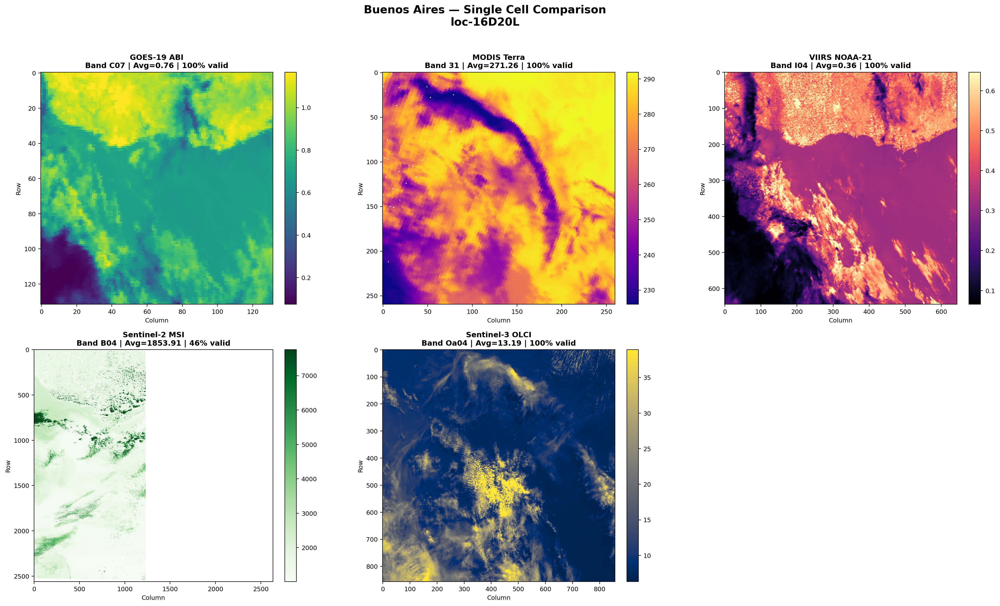

# aer 🪐

> **One pip install. One code block. One PNG.**
> Plugin-based satellite data extraction — from search to analysis-ready GeoTIFF in minutes.



---

## Copy-Paste → PNG
```bash
pip install aer-eo aer-search-aws-goes aer-extract-satpy
```

```python
from datetime import datetime, timezone
from aer.client import AerClient
from aer.interfaces import ExtractionProfile
import rasterio, matplotlib.pyplot as plt

client = AerClient()
results = client.search(
    collections=["ABI-L1b-RadF"],
    start_datetime=datetime(2026, 4, 1, 15, 0, tzinfo=timezone.utc),
    end_datetime=datetime(2026, 4, 1, 15, 10, tzinfo=timezone.utc),
    search_params={"ABI-L1b-RadF": {"satellite": "GOES-19"}},
)
profiles = [ExtractionProfile(
    name="c07", resolution=2000,
    collection_variables_map={"ABI-L1b-RadF": ["C07"]},
    extract_params={"reader": "abi_l1b"},
)]
tasks = client.prepare_for_extraction(results, profiles=profiles, uri="out")
artifacts = client.extract_batches(tasks)

# Render first GeoTIFF to PNG
with rasterio.open(artifacts[0].path) as src:
    plt.imsave("my_first_cell.png", src.read(1), cmap="viridis")
print(f"PNG saved: my_first_cell.png")
```

---

## 🌐 Built on Major TOM

`aer` is one of the first frameworks to standardize on the [**Major TOM**](https://github.com/ESA-PhiLab/Major-TOM) grid — a globally uniform spatial index that makes pixels align across any sensor. Data extracted by `aer` is interoperable with the [Major TOM ecosystem](https://huggingface.co/Major-TOM).

---

<details>
<summary>🔐 NASA sensors</summary>

MODIS, VIIRS, and Sentinel-3 require [Earthdata](https://urs.earthdata.nasa.gov/) credentials:

```bash
echo "machine urs.earthdata.nasa.gov login YOUR_USER password YOUR_PASS" >> ~/.netrc
chmod 600 ~/.netrc
```

Full guide → [docs/installation.md](docs/installation.md)
</details>

<details>
<summary>❓ What just happened?</summary>

1. **Search** — `AerClient` found GOES-19 ABI granules for your time slot.
2. **Prepare** — `prepare_for_extraction` built grid-aligned tasks using the Major TOM grid.
3. **Extract** — `extract_batches` downloaded, resampled, and wrote a GeoTIFF.
4. **Render** — `rasterio` + `matplotlib` saved the TIFF as a PNG.
</details>

<details>
<summary>📡 More sensors & plugins</summary>

| Sensor | Example Collection(s) | Search Plugin | Extract Plugin | Auth |
|--------|----------------------|---------------|----------------|:----:|
| GOES ABI | `ABI-L1b-RadF` | `aer-search-aws-goes` | `aer-extract-satpy` | None ✅ |
| MODIS Terra | `MOD021KM` | `aer-search-earthaccess` | `aer-extract-satpy` | Earthdata 🔐 |
| Sentinel-2 MSI | *(via STAC)* | `aer-search-pc-sentinel2` | `aer-extract-pc-sentinel2` | None ✅ |
| Sentinel-3 OLCI | `S3A_OL_1_EFR` | `aer-search-earthaccess` | `aer-extract-satpy` | None ✅ |
| VIIRS (NOAA-21) | `VJ202IMG`, `VJ203IMG` | `aer-search-earthaccess` | `aer-extract-satpy` | Earthdata 🔐 |

Collection names are **case-insensitive**.
</details>

<details>
<summary>⚙️ Configuration-driven profiles</summary>

`AerProfile` is a Pydantic `BaseModel` — define profiles in YAML or JSON and load them at runtime.

```yaml
# profiles.yaml
profiles:
  - name: c07
    resolution: 2000
    collections: ["ABI-L1b-RadF"]
    collection_variables_map:
      ABI-L1b-RadF: ["C07"]
    extract_params:
      reader: abi_l1b
    downloader: my_package.downloaders.custom_downloader
```

```python
from aer.interfaces import AerProfile

profiles = AerProfile.from_yaml("profiles.yaml")
# profiles[0].downloader is now a live callable
```

Supported loaders:
- `AerProfile.from_yaml(path)` — load a YAML file
- `AerProfile.from_yaml_string(text)` — load from a YAML string
- `AerProfile.from_json(path)` — load a JSON file
- `AerProfile.from_config_dir(dir)` — load all `*.yaml` / `*.yml` / `*.json` files in a directory

See [`examples/profiles.yaml`](examples/profiles.yaml) for a full multi-sensor example.

</details>

<details>
<summary>🔌 Build your own plugin</summary>

Plugins are standard Python packages that declare `SearchProvider` or `Extractor` interfaces and register via `entry_points`. The `AerRegistry` discovers them at runtime — no manual wiring needed.

Full tutorial → [Plugin Developer Guide](docs/build-your-own-plugin.md)
</details>

<details>
<summary>📚 Architecture & docs</summary>

| Document | Description |
|----------|-------------|
| [Pipeline Architecture](docs/pipeline-architecture.md) | Three-phase pipeline with UML diagrams and data flow |
| [EOIDS Format](docs/eoids.md) | Output file structure convention (BIDS-inspired) |
| [Plugin System](docs/plugins.md) | How plugins are discovered and routed |
| [Examples](examples/README.md) | Jupyter notebooks for every supported sensor |
</details>

<details>
<summary>🛠 Development</summary>

```bash
git clone https://github.com/frandorr/aer.git && cd aer && uv sync
uv run pytest test/components/aer/spatial/   # test one component
uv run pytest                                 # full suite
uv run poly create component --name my_feat   # add a new component
```
</details>

---

MIT License
