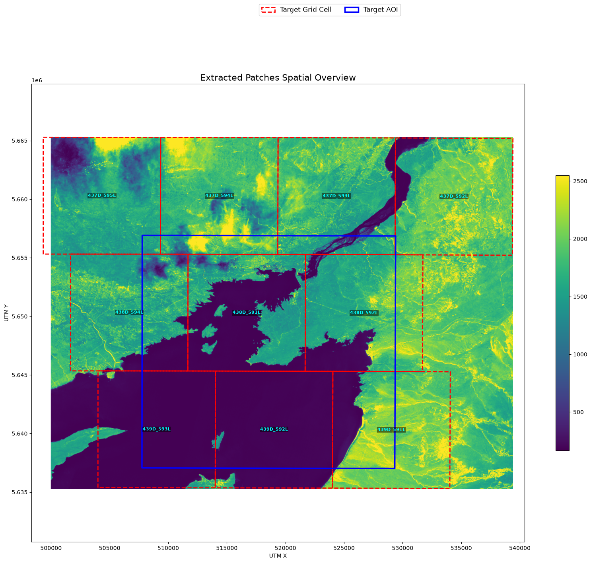
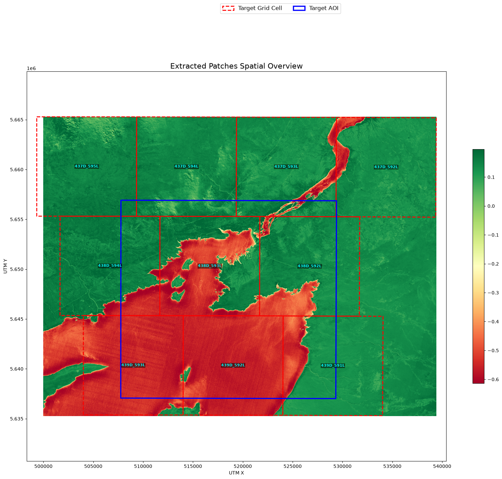
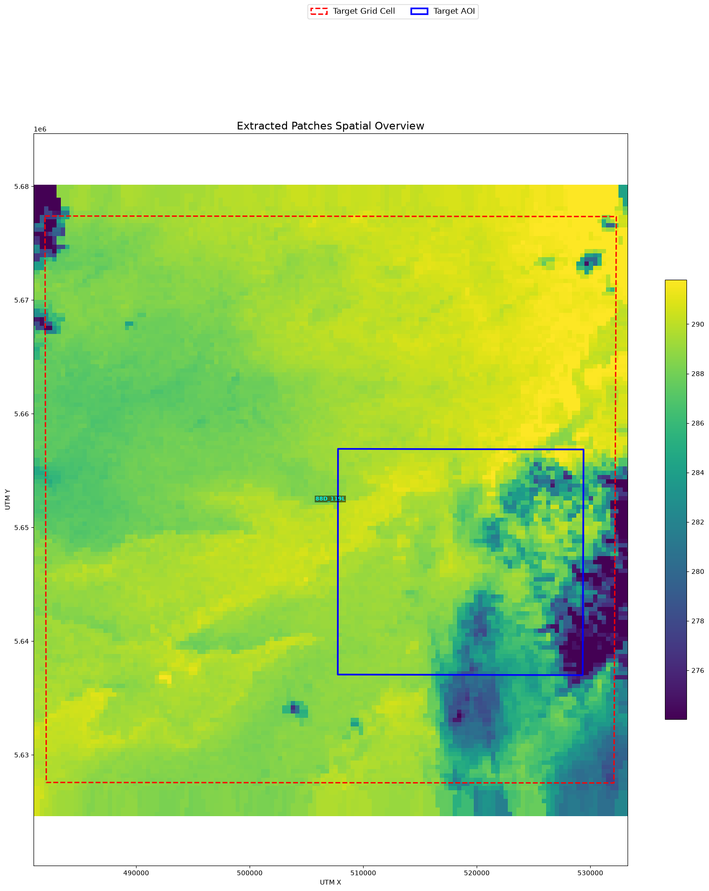
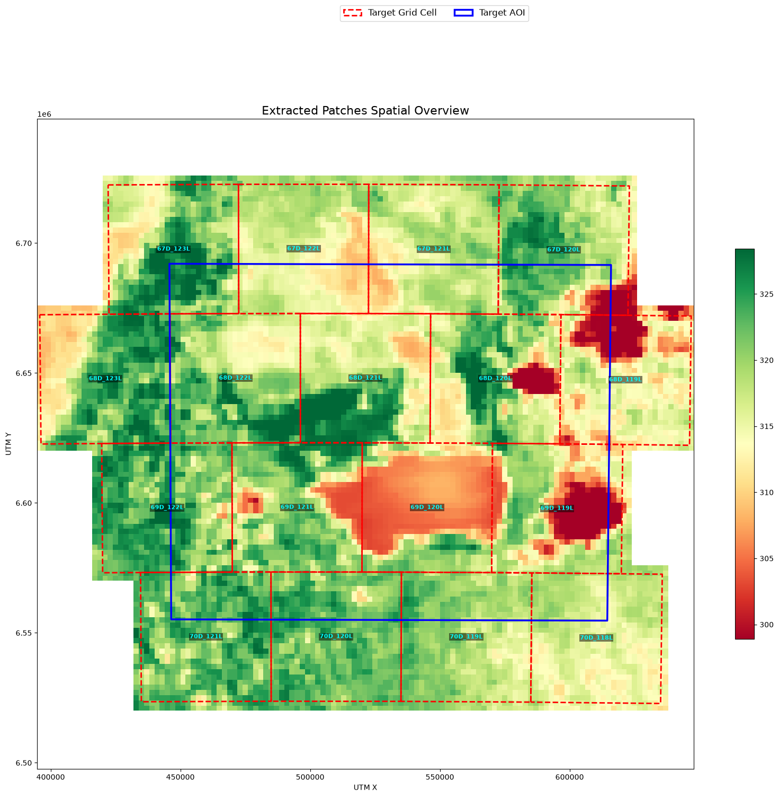
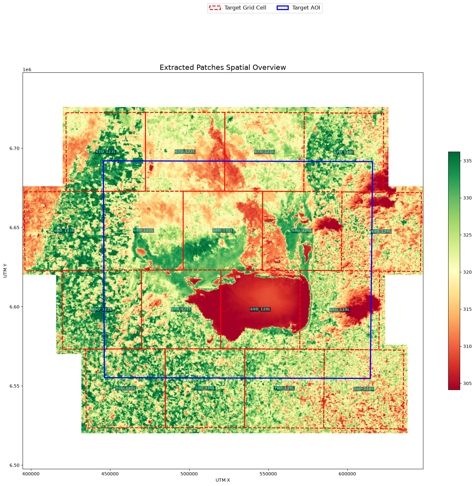
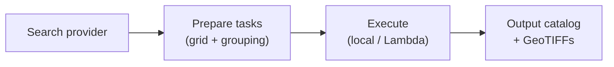

<p align="center">
  
</p>

# AerEO

> **Access, extract, reproject for Earth Observation — locally or remotely, without reinventing the wheel.**

AerEO is a plugin-based satellite data extraction framework. It wires together
the catalog, reading, reprojection, and writing tools you already trust (STAC,
Earthaccess, Satpy, `odc-geo`) behind a single pipeline where every step can be
replaced. The result: analysis-ready GeoTIFFs aligned to the [Major TOM
grid](https://github.com/ESA-PhiLab/Major-TOM), ready for ML or downstream analysis.

## Examples

All tutorial notebooks can be opened directly in Google Colab. Each notebook starts with a setup cell that installs AerEO and any sensor-specific plugins it needs.

| Notebook | Sensor(s) | Open in Colab |
|---|---|---|
| [01 — Sentinel-2](examples/01-sentinel2.ipynb) | Sentinel-2 L2A | [](https://colab.research.google.com/github/frandorr/aereo/blob/main/examples/01-sentinel2.ipynb) |
| [01b — Sentinel-2 NDVI](examples/01b-sentinel2-ndvi.ipynb) | Sentinel-2 L2A (NDVI) | [](https://colab.research.google.com/github/frandorr/aereo/blob/main/examples/01b-sentinel2-ndvi.ipynb) |
| [01c — Sentinel-2 NDWI](examples/01c-sentinel2-ndwi.ipynb) | Sentinel-2 L2A (NDWI) | [](https://colab.research.google.com/github/frandorr/aereo/blob/main/examples/01c-sentinel2-ndwi.ipynb) |
| [02 — VIIRS](examples/02-viirs.ipynb) | VIIRS | [](https://colab.research.google.com/github/frandorr/aereo/blob/main/examples/02-viirs.ipynb) |
| [03 — Sentinel-3 OLCI](examples/03-sentinel3.ipynb) | Sentinel-3 OLCI | [](https://colab.research.google.com/github/frandorr/aereo/blob/main/examples/03-sentinel3.ipynb) |
| [03b — Sentinel-3 NDVI](examples/03b-sentinel3-ndvi.ipynb) | Sentinel-3 OLCI (NDVI) | [](https://colab.research.google.com/github/frandorr/aereo/blob/main/examples/03b-sentinel3-ndvi.ipynb) |
| [04 — GeoTessera](examples/04-tessera.ipynb) | GeoTessera | [](https://colab.research.google.com/github/frandorr/aereo/blob/main/examples/04-tessera.ipynb) |
| [05 — GOES-19 ABI](examples/05-goes19.ipynb) | GOES-19 ABI | [](https://colab.research.google.com/github/frandorr/aereo/blob/main/examples/05-goes19.ipynb) |
| [06 — Multiple constellations](examples/06-multiple-constellation.ipynb) | VIIRS + GOES-19 | [](https://colab.research.google.com/github/frandorr/aereo/blob/main/examples/06-multiple-constellation.ipynb) |
| [Step by step raw pipeline](examples/step_by_step_raw.ipynb) | Sentinel-2 (raw API) | [](https://colab.research.google.com/github/frandorr/aereo/blob/main/examples/step_by_step_raw.ipynb) |

> **NASA Earthaccess authentication:** The [VIIRS](examples/02-viirs.ipynb),
> [Sentinel-3 OLCI](examples/03-sentinel3.ipynb), and
> [Sentinel-3 NDVI](examples/03b-sentinel3-ndvi.ipynb) notebooks use
> `earthaccess` to query NASA data. You must configure authentication first.
> The recommended way is to create a `~/.netrc` file — follow the
> [earthaccess authentication guide](https://earthaccess.readthedocs.io/en/latest/user/howto/authenticate/).
> For Google Colab, see [Running NASA notebooks in Colab](#running-nasa-notebooks-in-colab).

### Running NASA notebooks in Colab

In Colab, the simplest option is to call `earthaccess.login()` and enter your
NASA Earthdata username and password when prompted:

```python
import earthaccess

earthaccess.login()
```

If you prefer not to type credentials each time, set environment variables in a
notebook cell before calling `login`:

```python
import os
from getpass import getpass

os.environ["EARTHDATA_USERNAME"] = getpass("Earthdata username: ")
os.environ["EARTHDATA_PASSWORD"] = getpass("Earthdata password: ")

import earthaccess

earthaccess.login(strategy="environment")
```

Or write a `~/.netrc` file directly from the notebook:

```python
from pathlib import Path

Path.home().joinpath(".netrc").write_text(
    "machine urs.earthdata.nasa.gov login YOUR_USERNAME password YOUR_PASSWORD\n"
)
```

Replace `YOUR_USERNAME` and `YOUR_PASSWORD` with your NASA Earthdata credentials.

## Install

AerEO's core framework includes built-in search (STAC, NASA Earthaccess, etc.),
read, reproject, and write functions. You can extend it with plugins for other
sensors and formats — by combining search, read, reproject, and write plugins
you can access hundreds of constellations without changing your pipeline.

Several capabilities are shipped as optional dependencies (extras). If you are
trying AerEO for the first time, the easiest way to get everything is:

```bash
uv add "aereo[all]"
# or
pip install "aereo[all]"
```

For production, install only what you need. A few common combinations:

```bash
# STAC catalogs (Sentinel-2, Landsat, etc.)
uv add aereo
# or
pip install aereo

# NASA Earthaccess data (MODIS, VIIRS, Sentinel-3, etc.) with Satpy reading
uv add aereo aereo-read-satpy
# or
pip install aereo aereo-read-satpy

> The VIIRS and Sentinel-3 notebooks require a NASA Earthdata account. See the
> [earthaccess authentication guide](https://earthaccess.readthedocs.io/en/latest/user/howto/authenticate/)
> or the [Colab instructions](#running-nasa-notebooks-in-colab) below.

# GOES ABI public S3 data
uv add aereo aereo-search-aws-goes aereo-read-satpy
# or
pip install aereo aereo-search-aws-goes aereo-read-satpy

# GeoTessera tile catalogs
uv add aereo aereo-search-tessera aereo-read-tessera
# or
pip install aereo aereo-search-tessera aereo-read-tessera
```

Sensor-specific search and I/O plugins are separate packages so you only ship
what you need.

## Optional extras

AerEO's core install covers STAC search, ODC-based reprojection, GeoTIFF writing,
and local execution. A few built-in capabilities need extra dependencies:

| Extra | Enables | Install |
|---|---|---|
| `serverless` | `LambdaExecutor` and S3 staging (via `boto3`) | `uv add aereo[serverless]` |
| `swath` | `reproject_swath` / `reproject_pyresample` for 2-D lat/lon swath data | `uv add aereo[swath]` |
| `viz` | Cartopy-backed plots in `aereo.viz` | `uv add aereo[viz]` |
| `pc` | Microsoft Planetary Computer integration | `uv add aereo[pc]` |
| `all` | Everything above in one command | `uv add aereo[all]` |

## Copy/paste example

> **Performance tip:** Run AerEO in the same region as your data source. Being
> in the same region is **HIGHLY recommended** to avoid slow transfers and egress
> charges.

Save this as `quickstart.py` and run it with `uv run python quickstart.py`:

```python
"""Pure-Python quickstart for AerEO.
To run the full pipeline:

    uv run python examples/quickstart_pure_python.py
"""

from __future__ import annotations

from datetime import datetime, timezone

from shapely.geometry import Polygon

from aereo.builtins import (
    build_grouped_tasks,
    read_odc_stac,
    search_stac,
    write_geotiff,
)
from aereo.executors import LocalExecutor
from aereo.pipeline import ExtractionJob


def main() -> None:
    """Build a job in pure Python and run the extraction pipeline."""
    # Tiny AOI around Chocón reservoir, Argentina.
    aoi = Polygon(
        [
            (-68.90986824592407, -39.23705421799603),
            (-68.65925870907353, -39.23705421799603),
            (-68.65925870907353, -39.41589522092947),
            (-68.90986824592407, -39.41589522092947),
            (-68.90986824592407, -39.23705421799603),
        ]
    )

    job = ExtractionJob(
        name="quickstart",
        grid_dist=10_000,
        output_uri="/tmp/aereo_quickstart",
        search=search_stac,
        read=read_odc_stac,
        write=write_geotiff,
        target_aoi=aoi,
    )

    print("--- ExtractionJob ---")
    print(f"name: {job.name}")
    print(f"output_uri: {job.output_uri}")
    print(f"grid_dist: {job.grid_dist}")

    print("\n--- Search ---")
    assets = job.search(
        stac_api_url="https://earth-search.aws.element84.com/v1",
        collections={"sentinel-2-l2a": ["red", "nir"]},
        intersects=aoi,
        start_datetime=datetime(2024, 1, 1, tzinfo=timezone.utc),
        end_datetime=datetime(2024, 1, 10, tzinfo=timezone.utc),
    )
    print(f"Found {len(assets)} asset rows")

    if assets.empty:
        print("No assets found; nothing to extract.")
        return

    print("\n--- Build tasks ---")
    tasks = job.build_tasks(assets, build_grouped_tasks)
    print(f"Built {len(tasks)} task(s)")

    print("\n--- Extract ---")
    artifacts = job.execute(tasks, executor=LocalExecutor(workers=1))
    print(f"Extracted {len(artifacts)} artifact(s)")

    catalog_uri = job.write_catalog(artifacts)
    print(f"\nCatalog written to: {catalog_uri}")


if __name__ == "__main__":
    main()
```

Open `/tmp/aereo_quickstart` — you have GeoTIFFs on the Major TOM grid. The script also calls `job.write_catalog(artifacts)`, so an `artifacts.parquet` catalog is written next to the GeoTIFFs.

## What you get

These outputs come straight from the tutorial notebooks. Every plot shows
grid-aligned patches on the Major TOM grid, with the target AOI overlaid.

### [Sentinel-2 (nir, red)](examples/01-sentinel2.ipynb)



### [Sentinel-2 NDVI](examples/01b-sentinel2-ndvi.ipynb)



### [VIIRS](examples/02-viirs.ipynb)



### VIIRS vs GOES-19 ABI — same grid, different sensors

The same Major TOM grid cells extracted from two very different sensors:

| GOES-19 ABI | VIIRS |
|---|---|
|  |  |

See the full walkthrough in [06 — Multiple constellations](examples/06-multiple-constellation.ipynb).

## How it works



1. **Search** — query a catalog and get a validated `GeoDataFrame[AssetSchema]`.
2. **Prepare** — group assets by time and native CRS into `ExtractionTask`
   objects.
3. **Execute** — run each task through `read → preprocess → reproject →
   postprocess → write`, producing grid-aligned artifacts and a catalog.

Any stage can be replaced by a function you write. Learn how in
[Build a Plugin](https://frandorr.github.io/aereo/plugins/build-a-plugin/).

## Why AerEO?

| Problem | How AerEO solves it |
|---|---|
| Every catalog has a different API | One `job.search(...)` call with swappable search functions. |
| Tiles do not line up across sensors | Built-in Major TOM grid + local UTM patch geoboxes. |
| Reprojection boilerplate | Readers/writers can call `reproject_odc` (or any reprojector) as needed. |
| Mixed-CRS scenes fail | `build_grouped_tasks` groups assets by native CRS. |
| Notebook → production is hard | Same config package runs in Python and AWS Lambda. |
| Plugin frameworks force inheritance | AerEO plugins are `@validate_call` functions + standard entry points. |

## Core concepts

1. **`ExtractionJob`** — a validated bundle of grid size, output URI, AOI, and reader/writer callables.
2. **Search function** — e.g. `search_stac`. Pass it to `job.search(...)` with kwargs.
3. **Task builder function** — e.g. `build_grouped_tasks`. Groups assets into `ExtractionTask` objects.
4. **`ExtractionTask`** — one unit of work: assets + grid patches + stage pipeline.
5. **Stage functions** — `read_odc_stac`, `reproject_odc`, `ndvi`, `write_geotiff`, etc. Passed directly to `ExtractionJob(read=..., write=...)`.
6. **`LocalExecutor`** — runs tasks locally. Swap for `LambdaExecutor` later without changing the pipeline.

## Docs

- [Install](https://frandorr.github.io/aereo/install/) — per-sensor install and credentials
- [Your First Pipeline](https://frandorr.github.io/aereo/getting-started/first-pipeline/) — first extraction in 5 minutes
- [Configuration](https://frandorr.github.io/aereo/configuration/config-package/) — Hydra config package and YAML schema
- [Tutorials](https://frandorr.github.io/aereo/examples/) — Sentinel-2, VIIRS, Sentinel-3, Tessera, GOES-19
- [Build a Plugin](https://frandorr.github.io/aereo/plugins/build-a-plugin/) — add a search, reader, or processing step
- [Run on AWS Lambda](https://frandorr.github.io/aereo/serverless/lambda/) — go serverless by changing one line

---

Apache License 2.0
