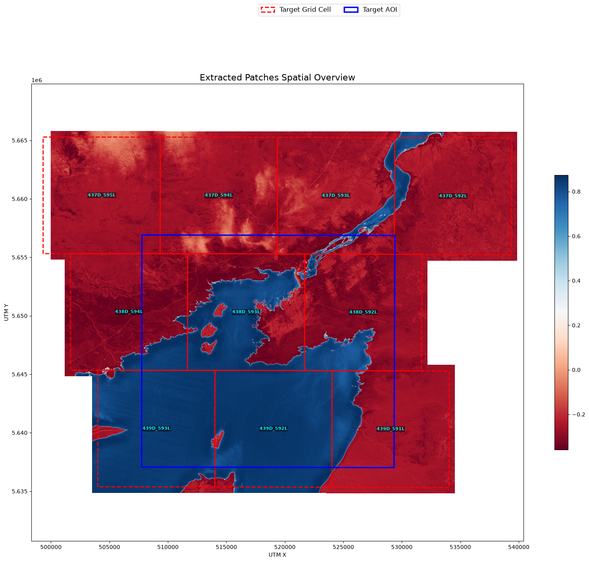
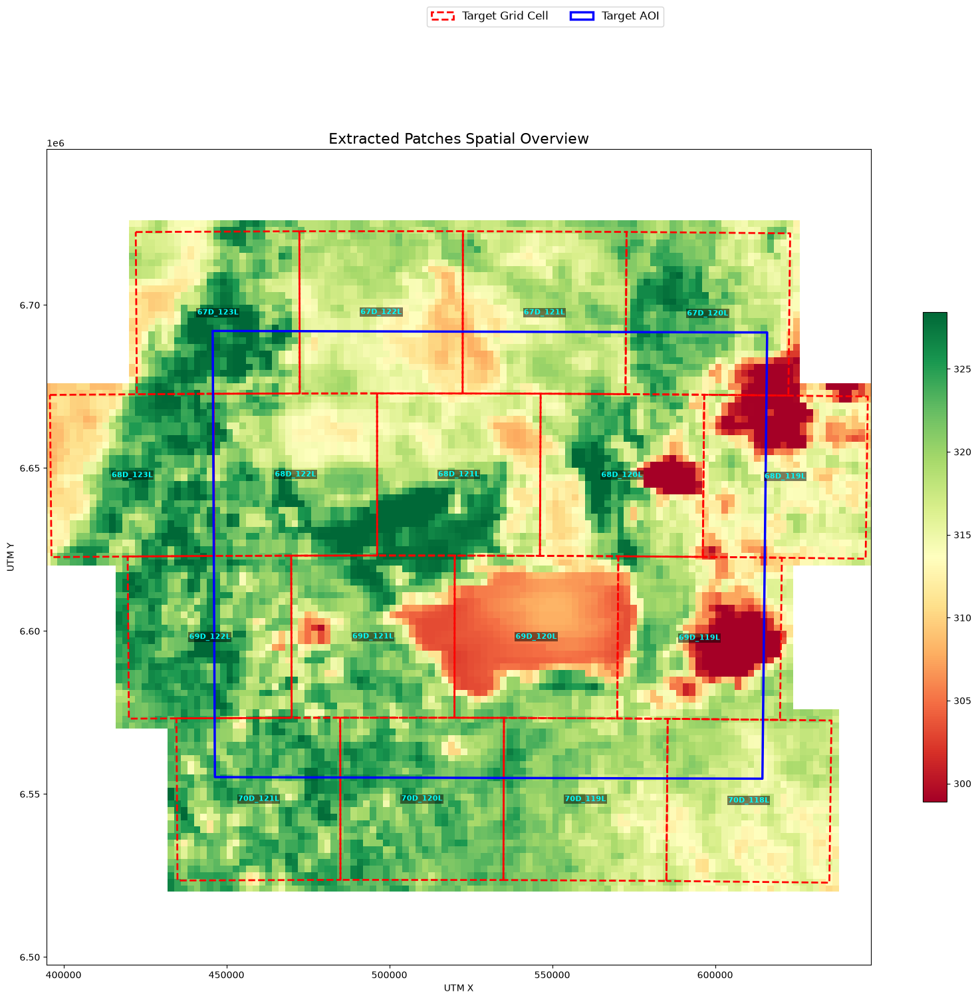
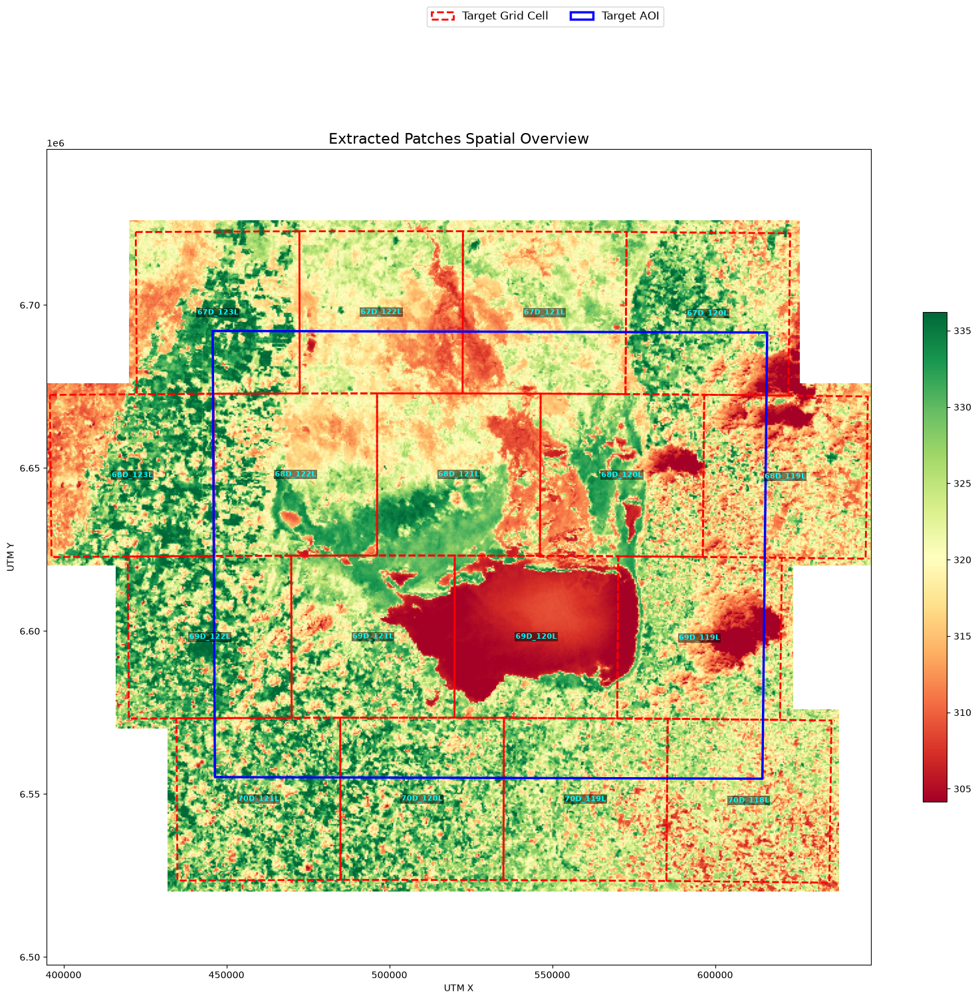
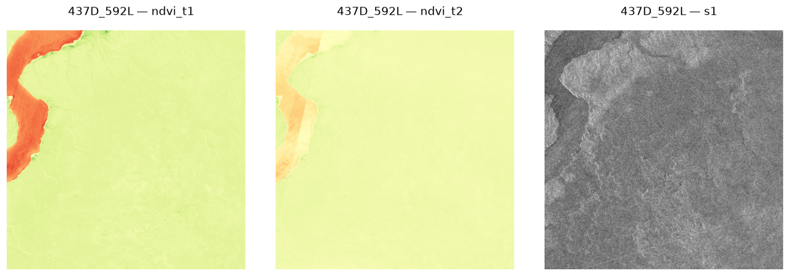
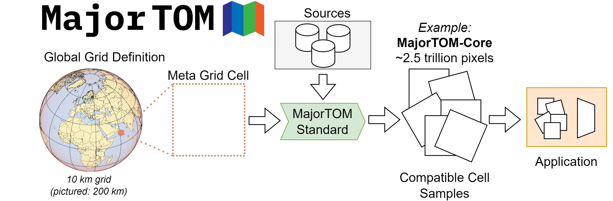

<p align="center">
  
</p>

# AerEO

> **One job definition. Every sensor on the same grid. Run it locally or on AWS Lambda.**

[](https://frandorr.github.io/aereo/install/)
[](https://frandorr.github.io/aereo)
[](https://frandorr.github.io/aereo-notebooks)
[](LICENSE)

AerEO is a plugin-based satellite data extraction framework. You declare an
**`ExtractionJob`** — search, read, process, write — and AerEO delivers
analysis-ready GeoTIFFs aligned to the [Major TOM
grid](https://github.com/ESA-PhiLab/Major-TOM), plus an `artifacts.parquet`
index where every row is a grid cell observation. Because every sensor lands on
the same grid cells, multi-sensor and multi-date outputs join.

Every pipeline stage is a plain Python function: keep the built-ins, swap one,
or ship your own as a plugin.



## What makes AerEO different

| | |
|---|---|
| **Jobs, not scripts** | One `ExtractionJob` bundles grid, AOI, and pipeline stages — the same object runs in a notebook, a script, or Lambda. |
| **One grid for every sensor** | Outputs align to Major TOM cells via a deterministic per-cell `GeoBox`. Optical, SAR, different dates — identical pixels. |
| **A catalog you can query** | Every run writes `artifacts.parquet` — a Major TOM index with one row per (grid cell, observation), ready to join across constellations. |
| **Local today, serverless tomorrow** | `LocalExecutor` → `LambdaExecutor` is a one-line change; the job doesn't move. |
| **Plugins are functions** | No base classes. A typed function + an entry point is a plugin. |

## See it

Sentinel-2 NDWI extracted as Major TOM grid cells:

<p align="center">
  
</p>

The same grid cells from two very different sensors:

<div align="center">
<table>
  <tr>
    <th>GOES-19 ABI</th>
    <th>VIIRS</th>
  </tr>
  <tr>
    <td></td>
    <td></td>
  </tr>
</table>
</div>

And a multi-sensor training batch joined by `grid_cell` — Sentinel-2 NDVI at two
dates + Sentinel-1 SAR, mosaicked per cell:

<p align="center">
  
</p>

## Install

```bash
uv add "aereo[all]"
# or
pip install "aereo[all]"
```

Sensor-specific search and I/O plugins are separate packages, so you only ship
what you need. Per-sensor install commands and credentials:
[Install](https://frandorr.github.io/aereo/install/). Python 3.12+.

> **Performance tip:** run AerEO in the same AWS region as your data source —
> cross-region downloads are slow and incur egress charges.

## Quickstart

Save as `quickstart.py`, run with `uv run quickstart.py` (no credentials
needed; fastest in Colab or an AWS instance in `us-west-2`):

```python
"""Pure-Python quickstart for AerEO."""

from datetime import datetime, timezone

from shapely.geometry import Polygon

from aereo.builtins import (
    build_grouped_tasks,
    read_odc_stac,
    search_stac,
    write_geotiff,
)
from aereo.executors import LocalExecutor
from aereo.pipeline import ExtractionJob

# Tiny AOI around Chocón reservoir, Argentina.
aoi = Polygon(
    [
        (-68.90986824592407, -39.23705421799603),
        (-68.65925870907353, -39.23705421799603),
        (-68.65925870907353, -39.41589522092947),
        (-68.90986824592407, -39.41589522092947),
        (-68.90986824592407, -39.23705421799603),
    ]
)

job = ExtractionJob(
    name="quickstart",
    grid_dist=10_000,
    output_uri="/tmp/aereo_quickstart",
    search=search_stac,
    read=read_odc_stac,
    write=write_geotiff,
    target_aoi=aoi,
)

assets = job.search(
    stac_api_url="https://earth-search.aws.element84.com/v1",
    collections={"sentinel-2-l2a": ["red", "nir"]},
    intersects=aoi,
    start_datetime=datetime(2024, 1, 1, tzinfo=timezone.utc),
    end_datetime=datetime(2024, 1, 10, tzinfo=timezone.utc),
)
tasks = job.build_tasks(assets, build_grouped_tasks)
artifacts = job.execute(tasks[:1], executor=LocalExecutor(workers=1))  # first task only
catalog_uri = job.write_catalog(artifacts)
print(f"Catalog: {catalog_uri}")
```

Open `/tmp/aereo_quickstart` — GeoTIFFs on the Major TOM grid plus
`artifacts.parquet`, one row per grid cell.

**Prefer config files?** The same job is a small YAML with Hydra `_target_`
entries; override anything from Python or the CLI. See
[Configuration](https://frandorr.github.io/aereo/configuration/config-package/).

## Examples

Runnable notebooks for every workflow — open in Colab or read as an executable
book at **[frandorr.github.io/aereo-notebooks](https://frandorr.github.io/aereo-notebooks)**.

| I want to... | Notebook | |
|---|---|---|
| Try it without credentials | [01 — Sentinel-2](examples/01-sentinel2.ipynb) | [](https://colab.research.google.com/github/frandorr/aereo/blob/main/examples/01-sentinel2.ipynb) |
| Compute a vegetation index | [01b — Sentinel-2 NDVI](examples/01b-sentinel2-ndvi.ipynb) | [](https://colab.research.google.com/github/frandorr/aereo/blob/main/examples/01b-sentinel2-ndvi.ipynb) |
| Compute a water index | [01c — Sentinel-2 NDWI](examples/01c-sentinel2-ndwi.ipynb) | [](https://colab.research.google.com/github/frandorr/aereo/blob/main/examples/01c-sentinel2-ndwi.ipynb) |
| Pull thermal bands from NASA | [02 — VIIRS](examples/02-viirs.ipynb) | [](https://colab.research.google.com/github/frandorr/aereo/blob/main/examples/02-viirs.ipynb) |
| Extract Sentinel 3 OLCI | [03 — Sentinel-3 OLCI](examples/03-sentinel3.ipynb) | [](https://colab.research.google.com/github/frandorr/aereo/blob/main/examples/03-sentinel3.ipynb) |
| Compute NDVI from Sentinel-3 | [03b — Sentinel-3 NDVI](examples/03b-sentinel3-ndvi.ipynb) | [](https://colab.research.google.com/github/frandorr/aereo/blob/main/examples/03b-sentinel3-ndvi.ipynb) |
| Extract foundation-model embeddings | [04 — GeoTessera](examples/04-tessera.ipynb) | [](https://colab.research.google.com/github/frandorr/aereo/blob/main/examples/04-tessera.ipynb) |
| Use a geostationary sensor | [05 — GOES-19 ABI](examples/05-goes19.ipynb) | [](https://colab.research.google.com/github/frandorr/aereo/blob/main/examples/05-goes19.ipynb) |
| See two constellations on one grid | [06 — Multiple constellations](examples/06-multiple-constellation.ipynb) | [](https://colab.research.google.com/github/frandorr/aereo/blob/main/examples/06-multiple-constellation.ipynb) |
| Work with SAR (cloud-proof) | [07 — Sentinel-1 SAR](examples/07-sentinel1.ipynb) | [](https://colab.research.google.com/github/frandorr/aereo/blob/main/examples/07-sentinel1.ipynb) |
| Build an ML dataset from many sensors | [08 — ML-ready dataset](examples/08-ml-dataset.ipynb) | [](https://colab.research.google.com/github/frandorr/aereo/blob/main/examples/08-ml-dataset.ipynb) |
| Extend AerEO with my own code | [09 — Build your own plugin](examples/09-custom-plugin.ipynb) | [](https://colab.research.google.com/github/frandorr/aereo/blob/main/examples/09-custom-plugin.ipynb) |
| Pair weather + climate data | [10 — GOES-19 + CHIRPS](examples/10-earthlens.ipynb) | [](https://colab.research.google.com/github/frandorr/aereo/blob/main/examples/10-earthlens.ipynb) |
| Learn the raw API (no config files) | [Step by step raw](examples/step_by_step_raw.ipynb) | [](https://colab.research.google.com/github/frandorr/aereo/blob/main/examples/step_by_step_raw.ipynb) |

<details>
<summary><b>NASA Earthdata authentication for the VIIRS / Sentinel-3 notebooks</b></summary>

Those notebooks use `earthaccess`. Create a `~/.netrc` following the
[earthaccess authentication guide](https://earthaccess.readthedocs.io/en/latest/user/howto/authenticate/).
In Colab, run this once:

```python
import os
from getpass import getpass

username = getpass("Earthdata username: ")
password = getpass("Earthdata password: ")

netrc_path = os.path.expanduser("~/.netrc")
with open(netrc_path, "w") as f:
    f.write(f"machine urs.earthdata.nasa.gov login {username} password {password}\n")
os.chmod(netrc_path, 0o600)
```

</details>

## For ML users

After a run you have grid-aligned GeoTIFFs and `artifacts.parquet` — and that
parquet **is** a Major TOM index: one row per (grid cell, observation), with
`grid_cell`, `start_time`, `end_time`, `uri`, `collection`, and the cell
geometry, in the same spirit as the [Major-TOM Core
datasets](https://huggingface.co/datasets/Major-TOM/Core-S2L2A). Repeated cells
across rows are different observations of the same ground pixels, so joining
across sensors and dates is a filter, not a reprojection:

```python
import geopandas as gpd

df = gpd.read_parquet("output/artifacts.parquet")
print(df[["grid_cell", "collection", "start_time", "uri"]].head())
```

The full workflow — joins, gap-filling mosaics, a merged multi-sensor index —
is the [08 — ML-ready dataset](examples/08-ml-dataset.ipynb) notebook.

## Plugins

AerEO discovers plugins through the `aereo.plugins` entry-point group, so any
installed package can add search providers, readers, writers, and processors.

### Built-in plugins

These ship with `aereo` itself — no extra install needed:

| Plugin | Type | Description |
|---|---|---|
| `search_stac` | Search | Query any STAC API and return `GeoDataFrame[AssetSchema]` |
| `build_grouped_tasks` | Task builder | Group assets by time and native CRS into grid-aligned `ExtractionTask` objects |
| `read_odc_stac` | Reader | Load STAC assets via `odc.stac` into an `xarray.Dataset` |
| `reproject_odc` | Reprojector | Reproject/resample a dataset to a target geobox with `odc-geo` |
| `reproject_swath` | Reprojector | Resample swath data (e.g. VIIRS, OLCI) to a target grid with `pyresample` |
| `process_select_bands` | Processor | Subset a dataset to a list of bands |
| `process_qa_mask` | Processor | Apply a QA bit-mask band to the data |
| `process_ndvi` | Processor | Compute NDVI from NIR and red bands |
| `process_ndwi` | Processor | Compute NDWI from green and NIR bands |
| `process_normalize` | Processor | Normalize pixel values per band (min-max, z-score) |
| `process_composite` | Processor | Create a temporal composite (median, mean, ...) |
| `write_geotiff` | Writer | Write a dataset to GeoTIFF |

### Community plugins

| Plugin | Type | Description | Install |
|---|---|---|---|
| `aereo-search-aws-goes` | Search | Discover GOES-R series data (GOES-16 through GOES-19) on public NOAA AWS S3 buckets | [PyPI](https://pypi.org/project/aereo-search-aws-goes/) · [Repo](https://github.com/frandorr/aereo-search-aws-goes) |
| `aereo-search-tessera` | Search | Search [GeoTessera](https://geotessera.io) satellite embedding tiles | [PyPI](https://pypi.org/project/aereo-search-tessera/) · [Repo](https://github.com/frandorr/aereo-search-tessera) |
| `aereo-herbie` | Search + Reader | Discover and read NWP model data (HRRR, GFS, ECMWF, GEFS) via [Herbie](https://herbie.readthedocs.io/) GRIB2 inventories | [Repo](https://github.com/frandorr/aereo-herbie) |
| `aereo-read-satpy` | Reader | Load satellite data from many EO formats via [Satpy](https://satpy.readthedocs.io/) into `xarray.Dataset` | [PyPI](https://pypi.org/project/aereo-read-satpy/) · [Repo](https://github.com/frandorr/aereo-read-satpy) |
| `aereo-read-tessera` | Reader | Read GeoTessera satellite embedding tiles | [PyPI](https://pypi.org/project/aereo-read-tessera/) · [Repo](https://github.com/frandorr/aereo-read-tessera) |

To build your own, start from the
[aereo-plugin-template](https://github.com/frandorr/aereo-plugin-template) and
follow [Build a Plugin](https://frandorr.github.io/aereo/plugins/build-a-plugin/).

## Docs

[Install](https://frandorr.github.io/aereo/install/) ·
[Quickstart](https://frandorr.github.io/aereo/getting-started/pure-python/) ·
[Configuration](https://frandorr.github.io/aereo/configuration/config-package/) ·
[Tutorials](https://frandorr.github.io/aereo/examples/) ·
[Build a Plugin](https://frandorr.github.io/aereo/plugins/build-a-plugin/) ·
[Run on AWS Lambda](https://frandorr.github.io/aereo/serverless/lambda/)

<details>
<summary><b>Troubleshooting</b></summary>

| Symptom | Likely cause | Fix |
|---|---|---|
| `No assets found` | Date range or AOI too restrictive | Widen the time range or check the AOI geometry |
| Downloads are very slow | Running in a different AWS region than the data | Move your runtime to the data's region (e.g. `us-west-2` for Earth Search) |
| `earthaccess` authentication error | Missing `.netrc` or expired credentials | Follow the [earthaccess guide](https://earthaccess.readthedocs.io/en/latest/user/howto/authenticate/) |
| `grid_dist` looks wrong | It is in meters, not pixels or degrees | Use values like `10_000` for 10 km cells |
| Outputs do not line up | Different sensors without a shared grid | Ensure all jobs use the same `grid_dist` and Major TOM grid |

</details>

## Acknowledgments

- AerEO is inspired by the work done in [FDL sat-extractor](https://github.com/FrontierDevelopmentLab/sat-extractor).

  

- It is built upon the [Major TOM grid from ESA](https://github.com/ESA-PhiLab/Major-TOM).

  

---

Apache License 2.0
