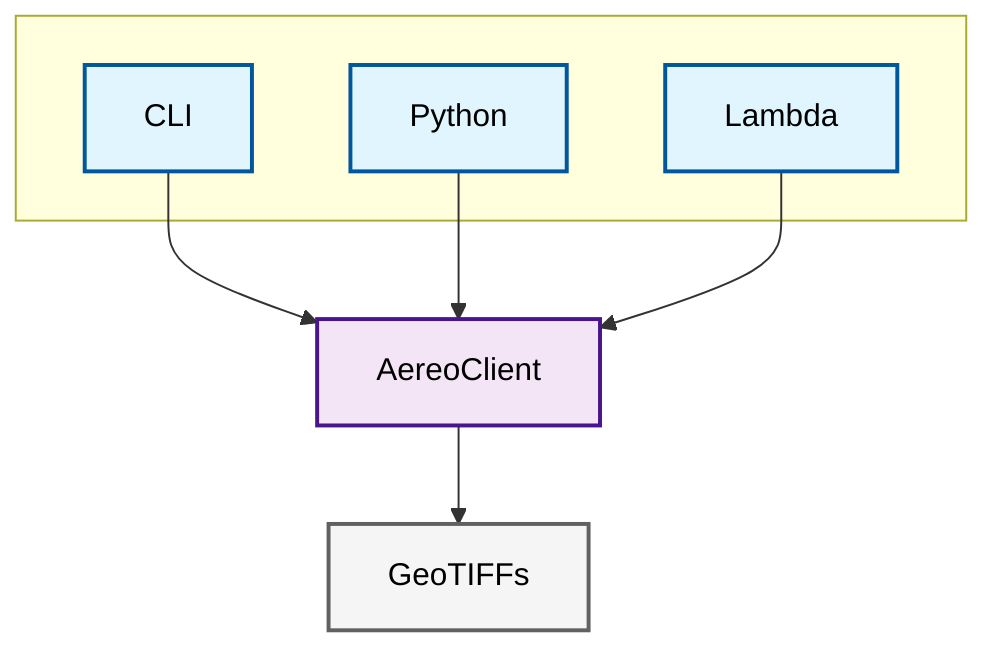
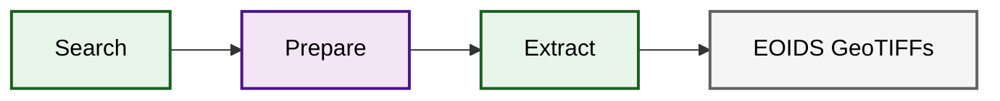
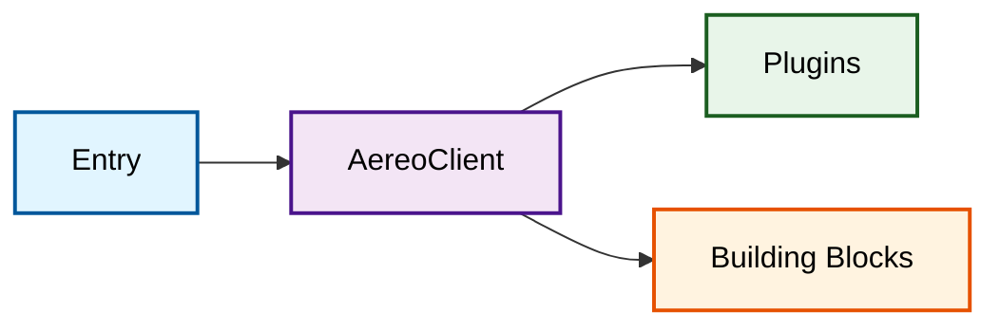
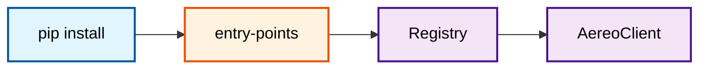
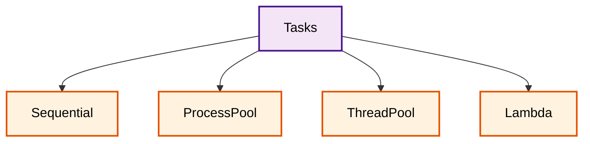
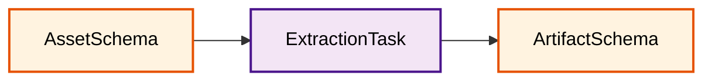
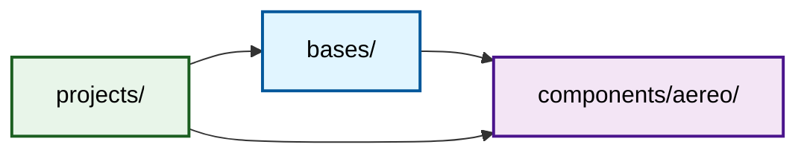

# AEREO Architecture — Simplified Visual Guide

> A clean, high-level map of the AEREO system. For deep implementation details, see [Pipeline Architecture](../concepts/pipeline-architecture.md).
>
> Rendered SVGs are available alongside this file: `aer-architecture-visualization-1.svg` through `aer-architecture-visualization-7.svg`.

---

## 1. AEREO at a Glance

Three entry points. One pipeline. GeoTIFF output.

---

## 2. The Pipeline

Always the same three steps.

---

## 3. What's Inside

Four layers. Entry drives Core. Core orchestrates Plugins and Building Blocks.

---

## 4. Plugin Discovery

Install a pip package. AEREO finds it automatically.

---

## 5. Execution Modes

Same tasks. Different backends.

---

## 6. Component Map

| Layer | Component | What it does |
|-------|-----------|--------------|
| **Entry** | `aereo.cli` | Terminal commands (`search`, `run`, `plugins`) |
| **Entry** | `aereo.client` | Python API — `AereoClient` class |
| **Entry** | `aereo.lambda_handler` | AWS Lambda entrypoint |
| **Core** | `aereo.interfaces` | Contracts — `SearchProvider`, `Reader`, `Processor`, `Reprojector`, `Writer`, `GridConfig`, `ExtractConfig` |
| **Core** | `aereo.registry` | Plugin discovery via `entry_points` |
| **Data** | `aereo.schemas` | Pandera validation — `AssetSchema`, `ArtifactSchema`, `GridSchema` |
| **Data** | `aereo.grid` | MajorTOM tiling — `GridDefinition`, `GridCell` |
| **Data** | `aereo.spatial` | CRS helpers — UTM EPSG lookup, reprojection |
| **Run** | `aereo.backends` | Backends — `LocalProcessBackend`, `ThreadBackend`, `TaskRunner` |
| **Run** | `aereo.serialization` | Task serialization for remote transport |
| **Run** | `aereo.asset_downloader` | Safe multi-process downloading (S3/HTTP/local) |
| **Output** | `aereo.eoids` | File naming & folder conventions |
| **Output** | `aereo.viz` | Quick plotting helpers |

---

## 7. Data Shapes

What flows through the pipeline.

---

## 8. Project Layout

AEREO is a Polylith monorepo.

