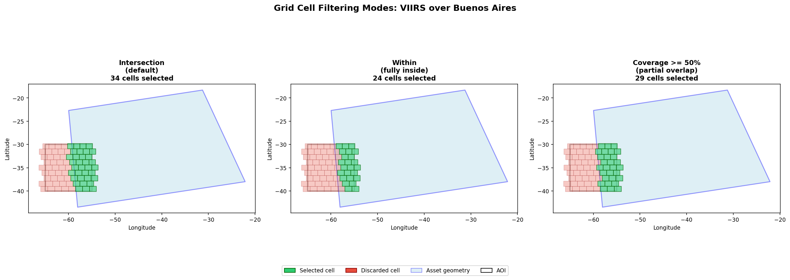
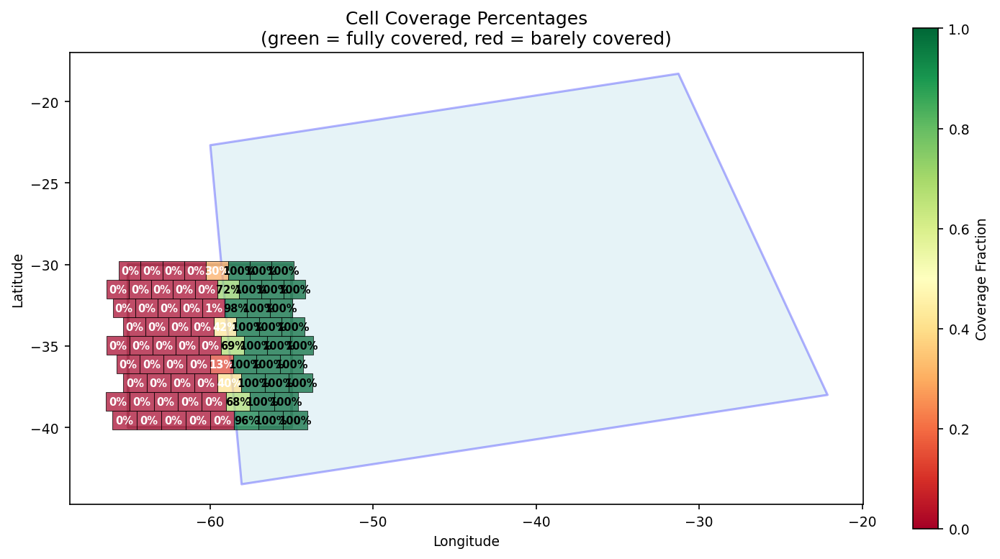

# Grid System

AEREO partitions the Earth into analysis-ready cells using the ESA Major TOM
grid conventions. Every extraction task is tied to a `GridCell`, and the set of
cells that cover an AOI is produced by a `GridDefinition`.

---

## GridDefinition

A `GridDefinition` creates the cells that intersect any polygon. It is the first
thing built during `prepare_tasks` (unless the extractor provides its own
defaults).

```python
from aereo.grid import GridDefinition
from shapely.geometry import box

# Create a grid with 256 km cells and no overlap
grid_def = GridDefinition(d=256000, overlap=False)

# Build cells over an AOI
aoi = box(-63.5, -41.0, -57.0, -34.0)
cells = list(grid_def.generate_grid_cells(aoi))
print(f"Generated {len(cells)} cells")
```

| Parameter | Description |
|-----------|-------------|
| `d` | Cell size in **metres** (e.g., `256000` for 256 km). |
| `overlap` | Whether to generate additional overlapping cells shifted by half a cell. Useful for mosaicking to avoid seams. |

Each cell receives a Major TOM-style ID such as `922U_249R`. Overlapping cells
append `_OV` (e.g., `922U_249R_OV`).

### `target_grid_dist` vs. `patch_config.resolution`

These two parameters are independent and easy to confuse:

| Parameter | Units | What it controls | Example |
|-----------|-------|------------------|---------|
| `target_grid_dist` | metres | Size of each **grid cell** | `256000` → 256 km square cell |
| `patch_config.resolution` | metres | Size of each **output pixel** inside the cell | `10` → 10 m pixel |

A 256 km cell at 500 m resolution is roughly a 512 × 512 pixel tile. If you set
`target_grid_dist=500` by mistake, every cell collapses to a single pixel.

### Overlapping cells

Set `overlap=True` when you want neighbouring cells to share a 50 % border:

```python
grid_def = GridDefinition(d=128000, overlap=True)
cells = list(grid_def.generate_grid_cells(aoi))
primary = [c for c in cells if c.is_primary]
overlap = [c for c in cells if not c.is_primary]
```

Overlapping cells are generated **in addition to** primary cells. They are
offset by half the cell size in both latitude and longitude. This is helpful for
algorithms that need continuous coverage without edge artifacts.

---

## GridCell

The fundamental unit of extraction. A `GridCell` represents a geographic area
with a known coordinate reference system, resolution, and pixel alignment.

```python
from aereo.grid import GridCell
from shapely.geometry import Polygon

cell = GridCell(
    d=10000,  # 10 km cell
    geom=Polygon([[0, 0], [1, 0], [1, 1], [0, 1]]),
    cell_id="loc-16D20L",
)
```

---

## Area definition

Convert a cell to an `odc.geo.GeoBox` for raster operations:

```python
geobox = cell.area_def(resolution=100, anchor="edge")
```

| Parameter | Description |
|-----------|-------------|
| `resolution` | Target pixel size in CRS units. |
| `anchor` | Pixel alignment: `"edge"` (top-left) or `"center"`. |
| `tight` | Disable pixel snapping for exact extents. |
| `conform_to` | Force uniform `(width, height)` across a batch. |

---

## Conform mode

When `conform_to=(w, h)` is provided, `tight=True` is enforced internally so
every cell in a batch has the exact same pixel dimensions — essential for
stacking arrays.

---

## Grid filtering modes

During `prepare_tasks`, AEREO intersects the generated grid with the **asset
geometry** (the actual satellite swath footprint, not the AOI). You can control
how strict that intersection is via the grid config or prepare arguments:

| Mode | Parameter | Behaviour | Use case |
|------|-----------|-----------|----------|
| **Intersection** | `grid_filter_mode='intersection'` (default) | Keeps any cell touching the asset geometry | Maximise coverage; may include mostly-empty cells |
| **Within** | `grid_filter_mode='within'` | Keeps only cells fully inside the asset geometry | Conservative; avoids edge effects |
| **Coverage** | `grid_filter_mode='coverage'` + `min_coverage=0.5` | Keeps cells where overlap fraction ≥ `min_coverage` | Tunable balance |

```python
from aereo.grid import UTMGridConfig

grid_config = UTMGridConfig(
    target_grid_dist=128000,
    grid_filter_mode="coverage",
    min_coverage=0.5,
)
```

### Visual summary

Real VIIRS granule over Buenos Aires with a 128 km grid. Green cells are
selected for extraction; red cells are discarded.



- **Intersection** (left, 34 cells selected) — keeps every cell the swath touches, even at a corner. Maximises coverage but may include mostly-empty cells.
- **Within** (centre, 24 cells selected) — keeps only cells fully inside the asset geometry. Conservative; avoids edge effects.
- **Coverage ≥ 50 %** (right, 29 cells selected) — keeps cells where at least half the cell area lies inside the swath. Tunable balance.

The coverage heatmap below shows the exact overlap fraction for every cell.
Green = fully covered, red = barely covered.



---

## Troubleshooting

### Grid cell size looks wrong

The default `target_grid_dist` is 256 km. If your AOI is a small city, a 256 km
cell will include a lot of surrounding area.

**Fix:** Use a smaller cell size:

```python
from aereo.grid import UTMGridConfig

grid_config = UTMGridConfig(target_grid_dist=50_000)  # 50 km cells
```

Remember: `target_grid_dist` controls the **cell** size in metres, while
`patch_config.resolution` controls the **pixel** size in metres. A 256 km cell at
500 m resolution is roughly a 512 × 512 pixel tile.

### CRS mismatch between adjacent cells

Each grid cell is naturally projected to its local UTM zone. Adjacent cells may
have different CRSs. When you mosaic them, AEREO reprojects everything to a
common CRS, but if you open individual cells manually, expect varying CRS
values.

### `conform_to` vs natural shapes

By default, each cell's output matches its natural UTM footprint, so adjacent
cells tile edge-to-edge with no gaps.

When you set `conform_to=(W, H)`, every cell is padded to the same pixel
dimensions with `NaN` fill. This is essential for ML pipelines but creates
padding borders that do not exist in natural-shape mode.

| Mode | Use case | Edge behaviour |
|------|----------|----------------|
| Natural (default) | Visualization, mosaics | Seamless tiling |
| `conform_to` | ML training, fixed tensors | `NaN` padding where data is missing |

Remember: `conform_to` is `(width, height)`, matching rasterio's
`(bands, height, width)` convention.
