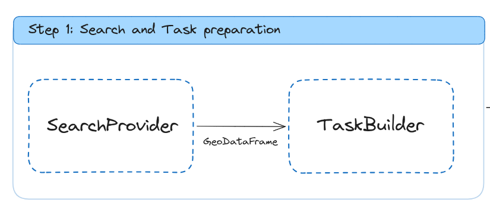
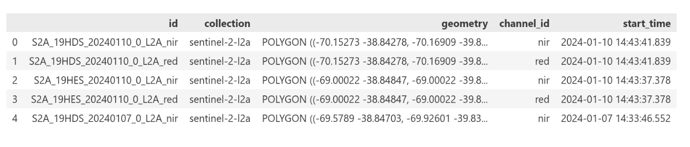
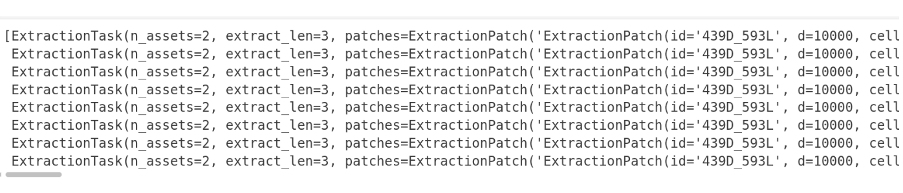
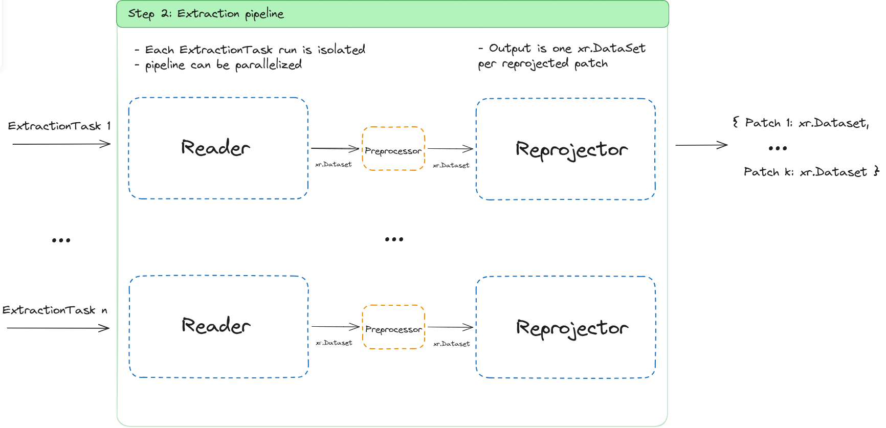
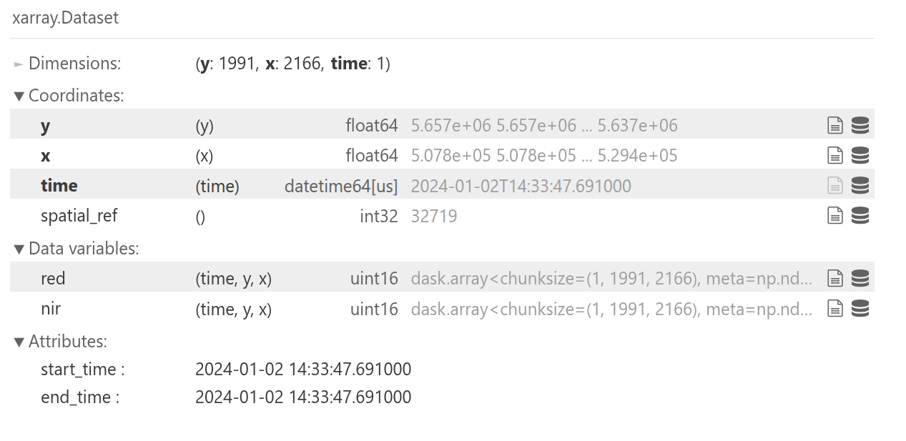
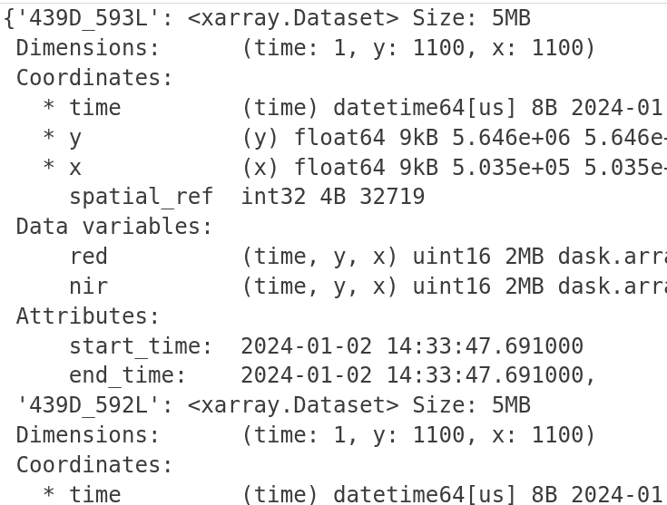
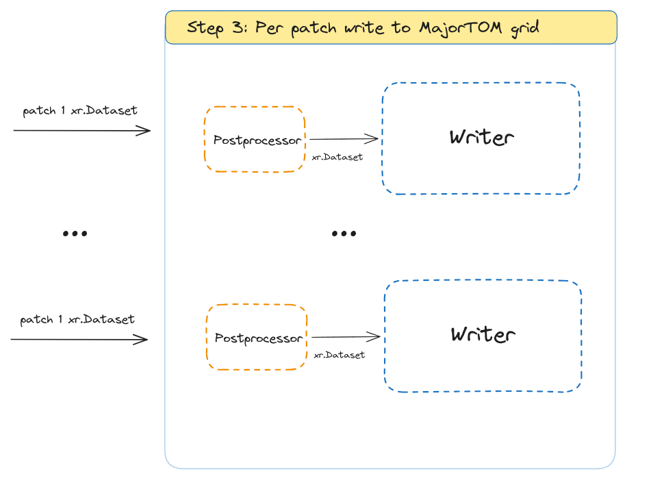
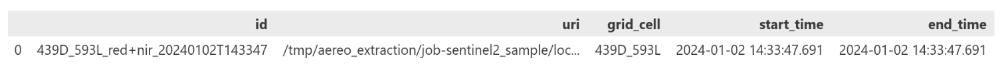
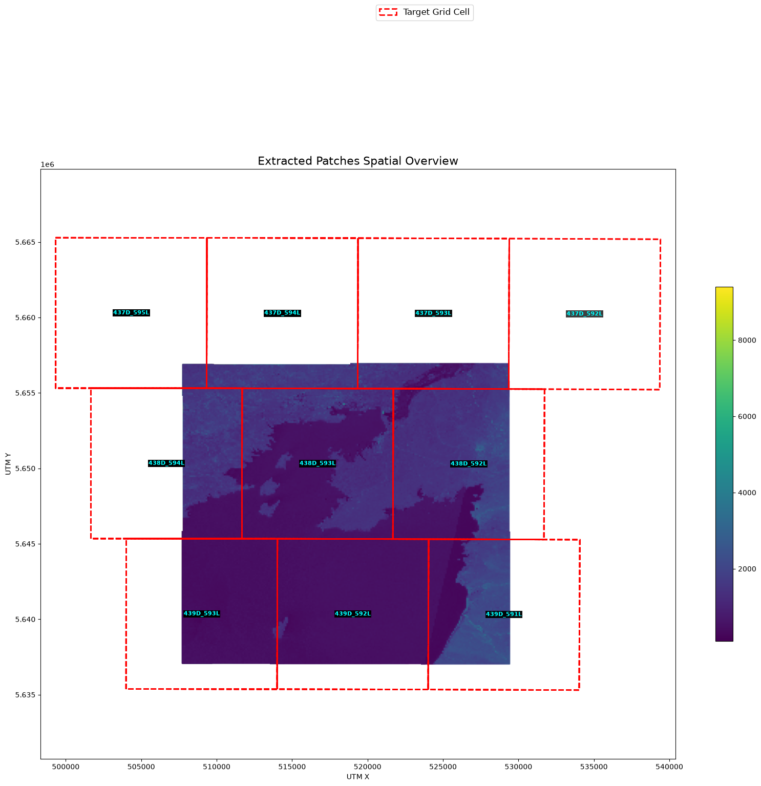

# AEREO Pipeline Walkthrough

This page walks through a complete AEREO extraction end-to-end, showing the
objects you meet at each step and how they fit together. The screenshots come
from the Sentinel-2 sample notebook (`examples/01-sentinel2.ipynb`), but the
same flow applies to any sensor plugin.

---

## What we are building

AEREO turns a **user query** (AOI + time range + collections) into
analysis-ready GeoTIFFs on a shared grid. The pipeline has three logical steps:

1. **Search and task preparation** — find the satellite assets and turn them
   into parallel `ExtractionTask`s.
2. **Extraction pipeline** — for every task, read the raw data, optionally
   preprocess it, and reproject each patch to the target grid.
3. **Per-patch write to MajorTOM grid** — post-process and write one GeoTIFF per
   grid cell.

---

## Step 1: Search and Task preparation

### Architecture



The first step is orchestrated by `AereoClient.search()` and
`AereoClient.build_tasks()`:

* **`SearchProvider`** queries the chosen catalog (STAC, Earthaccess, etc.) and
  returns a `GeoDataFrame` validated against `AssetSchema`.
* **`TaskBuilder`** takes that `GeoDataFrame`, builds the MajorTOM grid over the
  AOI, keeps only the cells touched by the asset footprints, and groups them
  into `ExtractionTask` objects.

The result is a sequence of isolated tasks that can later be executed in
parallel.

### Search output: `GeoDataFrame[AssetSchema]`



Each row is one discovered asset. The key columns are:

| Column | Why it matters |
|--------|----------------|
| `id` | Unique granule/asset identifier used downstream. |
| `collection` | Collection name, e.g. `sentinel-2-l2a`. |
| `geometry` | Satellite swath footprint in WGS84. |
| `channel_id` | Band or channel name when assets are split by band. |
| `start_time` / `end_time` | Acquisition window. |

### Prepared tasks: `Sequence[ExtractionTask]`



`build_tasks()` returns `ExtractionTask` objects. Each task carries:

* `assets` — the subset of the search results this task will read,
* `patches` — the grid cells (`ExtractionPatch`) it is responsible for,
* `extract` — the configured reader, processors, reprojector and writer,
* `output_uri` — where the artifacts should land.

Because each task is self-contained, the next step can run them in parallel
without shared state.

---

## Step 2: Extraction pipeline

### Architecture



Every `ExtractionTask` is executed independently through the same stage
pipeline:

1. **Reader** opens the source asset and returns an `xr.Dataset` or
   `xr.DataArray`.
2. **Preprocessors** (optional) transform the data — select bands, mask clouds,
   compute indices, etc.
3. **Reprojector** warps the data to each target patch's grid/GeoBox.

Because tasks are isolated, you can safely parallelize this step with a backend
such as `LocalProcessBackend` or `LambdaBackend`.

### Reader output: raw `xr.Dataset`



The reader loads the requested variables (`red`, `nir`) into a single
`xarray.Dataset`. Notice:

* Dimensions are still in the **native projection** (`y`, `x`, `time`).
* `time` has length 1 because this example uses a single acquisition.
* Coordinates include `spatial_ref` (the EPSG code) and the original
  acquisition timestamps.
* Data are loaded lazily as Dask arrays when the reader supports it.

### Reprojector output: one `xr.Dataset` per grid cell



After reprojection, the single scene is split into one `xr.Dataset` per target
cell. Here the keys are MajorTOM cell IDs such as `439D_593L` and
`439D_592L`. Each dataset now has:

* The same `time` coordinate (the original acquisition time),
* `y` and `x` dimensions aligned to the cell's local UTM grid,
* Consistent resolution and extent, so outputs from different sensors can be
  stacked later.

---

## Step 3: Per-patch write to MajorTOM grid

### Architecture



The final step runs once per reprojected patch:

1. **Postprocessors** (optional) apply final transformations — scaling,
   rounding, renaming variables, creating composites.
2. **Writer** persists the result as a GeoTIFF following the EOIDS layout.

### Artifact output: `GeoDataFrame[ArtifactSchema]`



`execute_tasks()` returns a validated `GeoDataFrame` with one row per artifact:

| Column | Why it matters |
|--------|----------------|
| `id` | Unique artifact ID, often combining cell, variable and timestamp. |
| `uri` | Absolute path to the written GeoTIFF. |
| `grid_cell` | MajorTOM cell ID, e.g. `439D_593L`. |
| `start_time` / `end_time` | Acquisition window carried over from the source asset. |

These artifacts are now ready for downstream ML workflows, mosaicking, or
further analysis.

### Visual check: resulting artifacts on the grid



The red solid lines are the MajorTOM grid cells that intersect the satellite
scene; the dashed rectangle is the full scene extent. This is the final mosaic
of extracted artifacts — each cell has been written as a separate GeoTIFF on the
shared grid.

---

## Full code snippet

```python
from aereo.client import AereoClient
from aereo.backends import LocalProcessBackend
from aereo.pipeline import ExtractionJob

# 1. Load the declarative job configuration
job = ExtractionJob.load_from_config(
    "examples/config",
    config_name="job_sentinel2",
)

# 2. Create the client
client = AereoClient()

# 3. Step 1: search + prepare tasks
results = client.search(job.search)
tasks = client.build_tasks(results, job=job)

# 4. Steps 2 & 3: extract and write
backend = LocalProcessBackend(max_workers=4)
artifacts = client.execute_tasks(tasks, backend=backend)

print(f"Wrote {len(artifacts)} artifacts to {job.output_uri}")
```

---

## Where to go next

* Learn the stage model in detail: [Pipeline Architecture](pipeline-architecture.md)
* Choose grid settings for your AOI: [Working with Grids](grids.md)
* Run the same pipeline from the CLI: [Run with CLI](../run/run-with-cli.md)
* Build a custom reader or search plugin: [Build Your First Plugin](../plugins/build-first-plugin.md)
