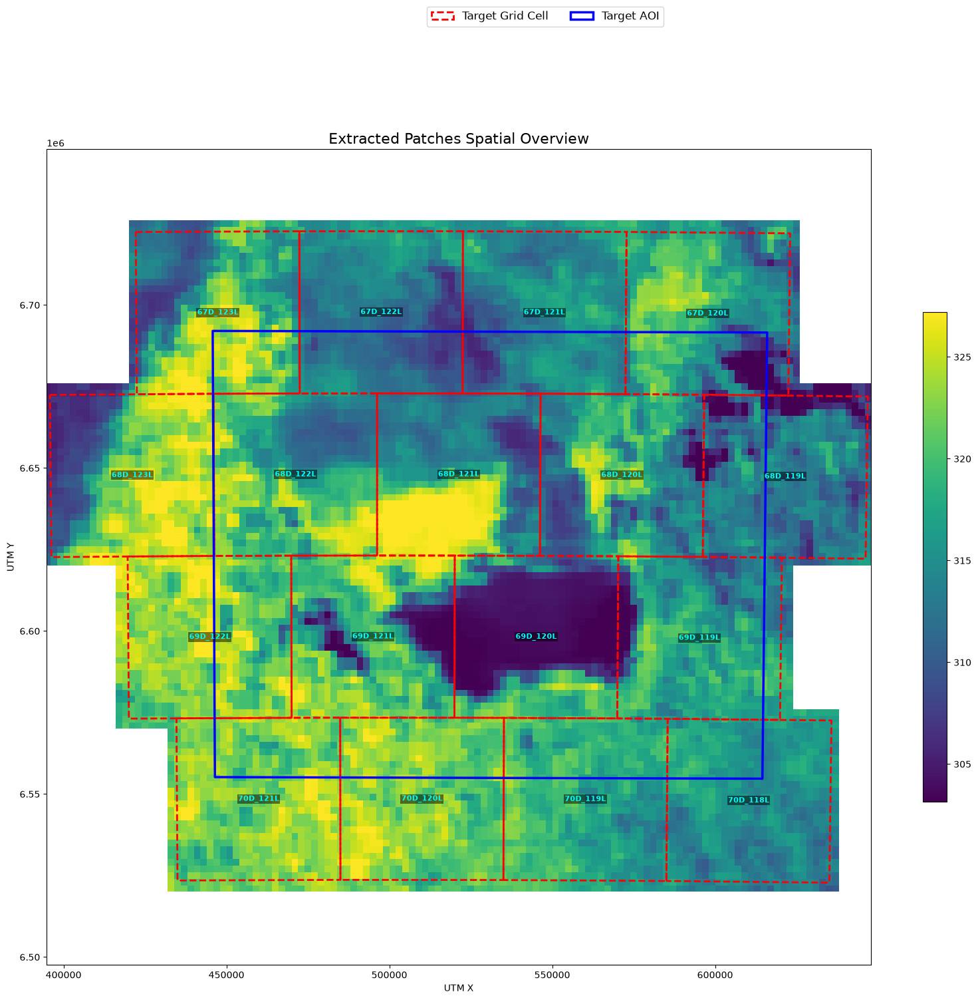
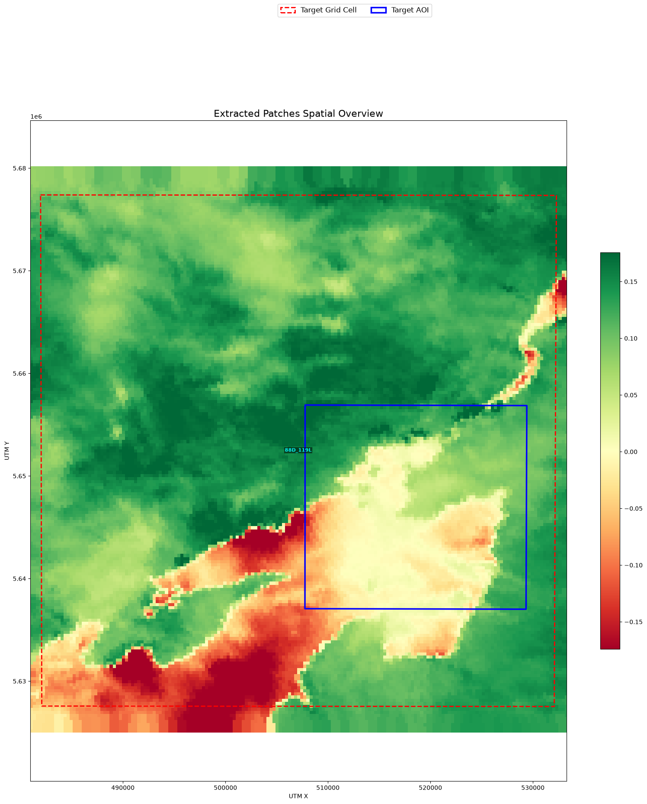
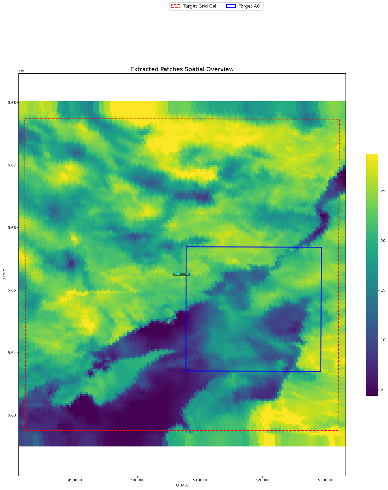
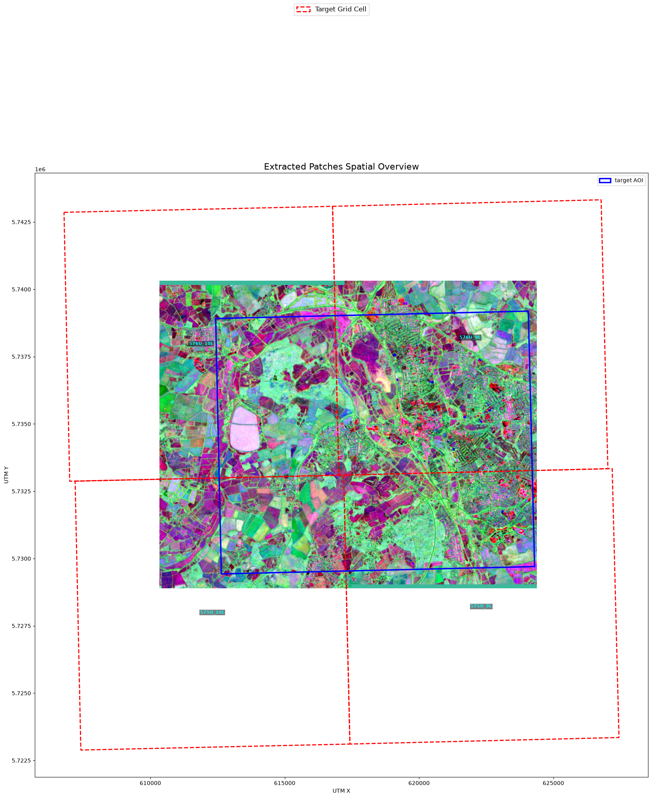

# Examples

AerEO ships with runnable Jupyter notebooks for every supported sensor and
workflow. Each notebook uses the Hydra config package in `examples/config` and
the `ExtractionJob` API: `search`, `build_tasks`, and `execute`.

The thumbnails below are real outputs from the notebooks — grid-aligned patches
on the Major TOM grid, with the target AOI overlaid.

## Before you run

Most examples perform live catalog searches and data downloads. Make sure you
have:

1. The **core package and any sensor-specific plugins** listed below.
2. **Credentials** for the catalog that requires them.
3. A few minutes of runtime for the extraction step.

## Beginner

| Notebook | Sensor | Plugins | Auth | What it teaches | Preview |
|---|---|---|---|---|---|
| [01 — Sentinel-2 true-color](01-sentinel2.ipynb) | Sentinel-2 MSI | `aereo` | Planetary Computer key (recommended) | Load a Hydra job, search STAC, extract a GeoTIFF on the Major TOM grid. |  |
| [05 — GOES-19 ABI preview](05-goes19.ipynb) | GOES-19 ABI | `aereo` + `aereo-search-aws-goes` + `aereo-read-satpy` | None | Public S3 search and Satpy-based reading/reprojection. |  |
| [step_by_step](step_by_step.ipynb) | Sentinel-2 MSI | `aereo` | Planetary Computer key (recommended) | Same as `01`, but each stage is run and inspected explicitly. | |
| [step_by_step_raw](step_by_step_raw.ipynb) | Sentinel-2 MSI | `aereo` | Planetary Computer key (recommended) | Same pipeline built entirely from raw Python — no config files or Hydra. | |

## Processing

| Notebook | Sensor | Plugins | Auth | What it teaches | Preview |
|---|---|---|---|---|---|
| [01b — Sentinel-2 NDVI](01b-sentinel2-ndvi.ipynb) | Sentinel-2 MSI | `aereo` | Planetary Computer key (recommended) | Add a processor stage (`NDVI`) before reprojection. |  |
| [01c — Sentinel-2 NDWI](01c-sentinel2-ndwi.ipynb) | Sentinel-2 MSI | `aereo` | Planetary Computer key (recommended) | Add a processor stage (`NDWI`) before reprojection. |  |
| [03b — Sentinel-3 NDVI](03b-sentinel3-ndvi.ipynb) | Sentinel-3 OLCI | `aereo` + `aereo-read-satpy` | NASA Earthdata | Processor stage with Satpy-based reading. |  |

## Sensors

| Notebook | Sensor | Plugins | Auth | What it teaches | Preview |
|---|---|---|---|---|---|
| [02 — VIIRS](02-viirs.ipynb) | VIIRS | `aereo` + `aereo-read-satpy` | NASA Earthdata | Search Earthaccess and read with Satpy. |  |
| [03 — Sentinel-3 OLCI](03-sentinel3.ipynb) | Sentinel-3 OLCI | `aereo` + `aereo-read-satpy` | NASA Earthdata | Sentinel-3 extraction workflow. |  |
| [04 — Tessera](04-tessera.ipynb) | GeoTessera | `aereo` + `aereo-search-tessera` + `aereo-read-tessera` | Depends on catalog | Tessera tile search and extraction. |  |
| [06 — Multiple constellations](06-multiple-constellation.ipynb) | Sentinel-2 + VIIRS | `aereo` + `aereo-read-satpy` | NASA Earthdata | Search and extract multiple sensors with a shared cache. |  |

## Run a notebook locally

```bash
cd examples
jupyter lab 01-sentinel2.ipynb
```

Or convert it to a script:

```bash
jupyter nbconvert --to script 01-sentinel2.ipynb
python 01-sentinel2.py
```

## Run the same config from the CLI

Every notebook config can also be run with the `aereo` CLI:

```bash
cd examples/config
aereo action=run \
  search=sentinel2_pc \
  grid_dist=grid_10km \
  read=sentinel2 \
  write=sentinel2
```

See [CLI](../user-guide/cli.md) for the full command reference, and the
[Configuration](../configuration/config-package.md) section for how the YAML
files are composed.

## Download notebooks

You can also download the raw notebooks directly from GitHub:

- [01-sentinel2.ipynb](https://github.com/frandorr/aereo/blob/main/examples/01-sentinel2.ipynb)
- [01b-sentinel2-ndvi.ipynb](https://github.com/frandorr/aereo/blob/main/examples/01b-sentinel2-ndvi.ipynb)
- [01c-sentinel2-ndwi.ipynb](https://github.com/frandorr/aereo/blob/main/examples/01c-sentinel2-ndwi.ipynb)
- [02-viirs.ipynb](https://github.com/frandorr/aereo/blob/main/examples/02-viirs.ipynb)
- [03-sentinel3.ipynb](https://github.com/frandorr/aereo/blob/main/examples/03-sentinel3.ipynb)
- [03b-sentinel3-ndvi.ipynb](https://github.com/frandorr/aereo/blob/main/examples/03b-sentinel3-ndvi.ipynb)
- [04-tessera.ipynb](https://github.com/frandorr/aereo/blob/main/examples/04-tessera.ipynb)
- [05-goes19.ipynb](https://github.com/frandorr/aereo/blob/main/examples/05-goes19.ipynb)
- [06-multiple-constellation.ipynb](https://github.com/frandorr/aereo/blob/main/examples/06-multiple-constellation.ipynb)
- [step_by_step.ipynb](https://github.com/frandorr/aereo/blob/main/examples/step_by_step.ipynb)
- [step_by_step_raw.ipynb](https://github.com/frandorr/aereo/blob/main/examples/step_by_step_raw.ipynb)
