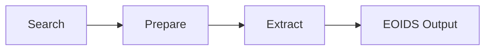
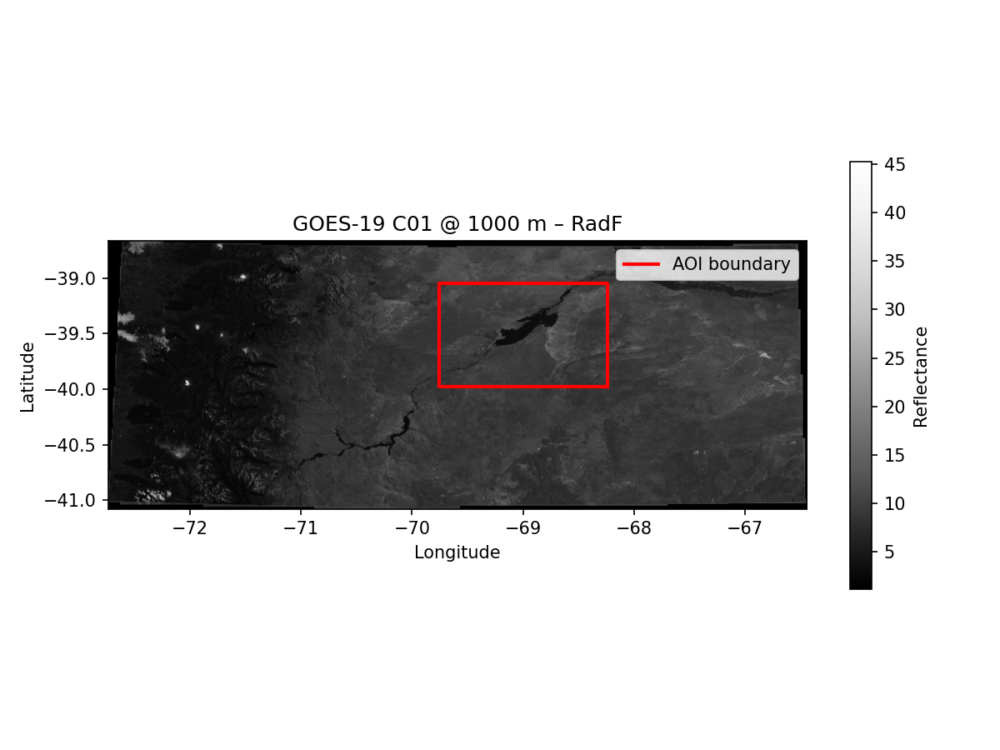

<p align="center">
    
</p>

<!--<h1 align="center">aer 🪐</h1>-->

<h1 align="center">
  Plugin-based satellite data extraction — from search to analysis-ready Major TOM grid in minutes.
</h1>

---

## TL;DR

```python
from aer.client import AerClient
from aer.interfaces import AerProfile

client = AerClient()
results = client.search(profiles=[...], start_datetime=..., end_datetime=...)
tasks = client.prepare_for_extraction(results, profiles=[...], uri="out")
artifacts = client.extract_batches(tasks)
```

---

## What is AER?

**AER** is a Python framework that makes extracting satellite imagery as easy as running a few lines of code. It handles the entire pipeline — **search**, **prepare**, and **extract** — so you can go from raw sensor archives to a grid-aligned GeoTIFF (or PNG) in minutes, not hours.

Whether you are working with **GOES**, **MODIS**, **VIIRS**, **Sentinel-2**, or **Sentinel-3**, AER lets you mix and match sensors through a unified interface. No need to learn a different API for every data provider.



<p align="center">
  <!-- ARCHITECTURE DIAGRAM PLACEHOLDER -->
  <!-- Replace the line below with an architecture/overview image -->
  <!--  -->
</p>

---

## The key benefits

### **AER is declarative and always runs the same way**

- **Profiles** define what you want to extract — resolution, variables, and sensor settings in a single object.
- **Batch extraction** handles multiple granules and grid cells in one call.
- **Configuration-driven** — load extraction profiles from YAML or JSON and keep your experiments reproducible.

### **Plugins unlock any sensor**

- **Swap sensors without rewriting code** — the same `AerClient` API works for GOES, MODIS, VIIRS, Sentinel-2, Sentinel-3, and more.
- **Plugin ecosystem** — install only what you need: search plugins find the data, extract plugins process it.
- **Build your own** — implementing a new `SearchProvider` or `Extractor` is standard Python packaging with entry points. AER discovers them automatically.

### **Major TOM grid = interoperable pixels**

- **Globally uniform spatial index** — every cell shares the same UTM-aligned footprint regardless of sensor.
- **Pixels align across sensors** — compare GOES, MODIS, and Sentinel data in the same grid cell without manual reprojection.
- **Interoperable with the Major TOM ecosystem** — extracted data drops straight into the [Major TOM](https://huggingface.co/Major-TOM) tooling and models.

---

## Start with a simple copy-paste example

We provide a simple copy-paste example below to get you started using two plugins: `aer-search-aws-goes` and `aer-extract-satpy`.

```bash
pip install aer-eo aer-search-aws-goes aer-extract-satpy
```

```python
from datetime import datetime, timezone

# --- Mosaic & plot extracted artifacts ---
import matplotlib.pyplot as plt  # noqa: E402
import numpy as np  # noqa: E402
from aer.client import AerClient
from aer.eoids import mosaic_eoids_tiles, scan_eoids_dir  # noqa: E402
from aer.interfaces import AerProfile
from pyproj import Transformer  # noqa: E402
from shapely.geometry import box
from shapely.ops import transform as shapely_transform  # noqa: E402

# ############################## CONFIG ####################################
DATE_START = datetime(2026, 4, 2, 14, 0, tzinfo=timezone.utc)
DATE_END = datetime(2026, 4, 2, 14, 9, tzinfo=timezone.utc)
URI = "/tmp/goes_extraction"
aoi = box(
    -69.75950213664814, -39.97992452755355, -68.24173711941097, -39.05094702427256
)
profiles = [
    AerProfile(
        name="goes_c02",
        resolution=500,
        collections={"ABI-L1b-RadF": ["C02"]},
        plugin_hints={"search": "search_aws_goes", "extract": "extract_satpy"},
        extract_params={"reader": "abi_l1b", "calibration": "reflectance"},
        search_params={"satellite": "GOES-19"},
    )
]

# ############################## SEARCH ####################################
client = AerClient()
print("Searching...", flush=True)
results = client.search(
    profiles=profiles,
    start_datetime=DATE_START,
    end_datetime=DATE_END,
    intersects=aoi,
)
# ############################## PREPARE ####################################
tasks = client.prepare_for_extraction(
    results,  # type: ignore[arg-type]
    target_aoi=aoi,
    uri=URI,
    profiles=profiles,
    target_grid_dist=256000,
    target_grid_overlap=False,
    prepare_params={"cells_per_chunk": 10},
)

# ############################## EXTRACT ####################################
results_df = client.extract_batches(
    tasks,
    max_batch_workers=None,
)

# ############################## PLOT ####################################
entries = scan_eoids_dir(URI)
collections = sorted({e["collection"] for e in entries})
print(f"Collections to mosaic: {collections}")

mosaic, transform, crs = mosaic_eoids_tiles(URI, collection=collections[0])

fig, ax = plt.subplots(figsize=(8, 6))
band = mosaic[0]
valid = band[(band != 0) & np.isfinite(band)]
vmin, vmax = valid.min(), valid.max()

im = ax.imshow(
    band,
    extent=(
        transform.c,
        transform.c + transform.a * mosaic.shape[2],
        transform.f + transform.e * mosaic.shape[1],
        transform.f,
    ),
    vmin=vmin,
    vmax=vmax,
    cmap="Greys_r",
)

# Reproject AOI boundary to mosaic CRS and overlay it
transformer = Transformer.from_crs("EPSG:4326", crs, always_xy=True)
aoi_projected = shapely_transform(transformer.transform, aoi)
xs, ys = aoi_projected.exterior.xy
ax.plot(xs, ys, color="red", linewidth=2, label="AOI boundary")

ax.legend(loc="upper right")
fig.colorbar(im, ax=ax, shrink=0.6, label="Reflectance")
ax.set_title(f"GOES-19 C01 @ 1000 m – {collections[0]}")
ax.set_xlabel("Longitude")
ax.set_ylabel("Latitude")
plt.tight_layout()
plt.savefig(f"{URI}/extraction_mosaic.png", dpi=150)

```

<p align="center">
  <!-- EXAMPLE OUTPUT IMAGE PLACEHOLDER -->
  <!-- Replace the line below with a sample output image -->
  
</p>

---

## Documentation

| Document | Description |
|----------|-------------|
| [Quick Start](quickstart.md) | Step-by-step Search → Prepare → Extract walkthrough |
| [Running the Pipeline](pipeline.md) | Practical guide for `search()`, `prepare_for_extraction()`, and `extract_batches()` |
| [Using Plugins](using-plugins.md) | Install core, plugins, and Earthdata auth |
| [Pipeline Architecture](pipeline-architecture.md) | Three-phase pipeline with UML diagrams and data flow |
| [Grid System](grid.md) | Grid definitions, filtering modes, and overlap options |
| [Plugin System](plugins.md) | How plugins are discovered and routed |
| [Build Your Own Plugin](build-your-own-plugin.md) | Developer guide for creating new plugins |
| [EOIDS](eoids.md) | Output file structure convention (BIDS-inspired) |
| [API Reference](api/client.md) | Python API documentation |

---

## Quick Links

- **Repository**: [github.com/frandorr/aer](https://github.com/frandorr/aer)
- **Issues**: [github.com/frandorr/aer/issues](https://github.com/frandorr/aer/issues)
- **License**: Apache License 2.0
