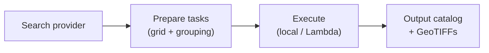

<div class="hero-banner" markdown>


**Access, extract, reproject for Earth Observation — locally or on AWS Lambda, without reinventing the wheel.**
</div>

# AerEO

AerEO is a plugin-based satellite data extraction framework. It wires together
the catalog, reading, reprojection, and writing tools you already trust (STAC,
Earthaccess, Satpy, `odc-geo`) behind a single pipeline where every step can be
replaced. The result: analysis-ready GeoTIFFs aligned to the [Major TOM
grid](user-guide/grids.md).

---

## Install

AerEO's core framework includes built-in search (STAC, NASA Earthaccess, etc.),
read, reproject, and write functions. You can extend it with plugins for other
sensors and formats — by combining search, read, reproject, and write plugins
you can access hundreds of constellations without changing your pipeline.

=== "STAC (Sentinel-2, Landsat, etc.)"

    ```bash
    uv add aereo
    # or
    pip install aereo
    ```

=== "NASA Earthaccess (MODIS, VIIRS, Sentinel-3, etc.)"

    ```bash
    uv add aereo aereo-read-satpy
    # or
    pip install aereo aereo-read-satpy
    ```

    Configure [earthaccess](https://github.com/nsidc/earthaccess) credentials
    (`.netrc`, environment variables, or `earthaccess.login()`) before searching.

=== "GOES ABI (public S3)"

    ```bash
    uv add aereo aereo-search-aws-goes aereo-read-satpy
    # or
    pip install aereo aereo-search-aws-goes aereo-read-satpy
    ```

    GOES data on AWS is public, so no authentication is required.

=== "GeoTessera"

    ```bash
    uv add aereo aereo-search-tessera aereo-read-tessera
    # or
    pip install aereo aereo-search-tessera aereo-read-tessera
    ```

    GeoTessera data is public, so no authentication is required.

> Install the core framework with `uv add aereo` (or `pip install aereo`).
> Sensor-specific plugins are separate packages so you only ship what you need.

---

## 10-line example

```python
from datetime import datetime, timezone
from aereo.builtins import search_stac, build_grouped_tasks
from aereo.executors import LocalExecutor
from aereo.pipeline import ExtractionJob

# 1. Load the job (grid + read/write stages)
job = ExtractionJob.load_from_config("examples/config", config_name="job_sentinel2")

# 2. Search   3. Prepare tasks   4. Execute
assets = job.search(
    search_stac,
    stac_api_url="https://earth-search.aws.element84.com/v1",
    collections={"sentinel-2-l2a": ["red", "nir"]},
    intersects="examples/config/aoi/chocon.geojson",
    start_datetime=datetime(2024, 1, 1, tzinfo=timezone.utc),
    end_datetime=datetime(2024, 1, 10, tzinfo=timezone.utc),
)
tasks = job.build_tasks(assets, build_grouped_tasks, cells_per_task=5)
artifacts = job.execute(tasks, executor=LocalExecutor(workers=2))
```

Open `job.output_uri` — you have GeoTIFFs on the Major TOM grid and an
`artifacts.parquet` catalog.

---

## What you get

These outputs come straight from the tutorial notebooks. Every plot shows
grid-aligned patches on the Major TOM grid, with the target AOI overlaid.

<div class="hero-grid" markdown>

-   ### [Sentinel-2 (nir, red)](examples/01-sentinel2.ipynb)

    

-   ### [Sentinel-2 NDVI](examples/01b-sentinel2-ndvi.ipynb)

    

-   ### [VIIRS](examples/02-viirs.ipynb)

    

-   ### [Multiple constellations](examples/06-multiple-constellation.ipynb)

    GOES-19 ABI and VIIRS extracted for the same grid cells:

    

    

</div>

See the full gallery in the [Tutorials](examples/index.md) section.

---

## How it works



1. **Search** — query a catalog and get a validated `GeoDataFrame[AssetSchema]`.
2. **Prepare** — group assets by time and native CRS into `ExtractionTask`
   objects.
3. **Execute** — run each task through `read → preprocess → reproject →
   postprocess → write`, producing grid-aligned artifacts and a catalog.

Any stage can be replaced by a function you write. Learn how in
[Build a Plugin](plugins/build-a-plugin.md).

---

## Why AerEO?

<div class="hero-grid" markdown>

-   ### Search anything

    One `job.search(...)` call works with STAC, Earthaccess, public S3, and
    custom catalogs. Swap the search function without changing your pipeline.

-   ### Grid aligned

    Outputs are indexed on the [Major TOM grid](user-guide/grids.md), so
    Sentinel-2, VIIRS, Sentinel-3, and GOES scenes stack together out of the
    box.

-   ### One config, three runtimes

    The same Hydra config package runs in a notebook, from the CLI, and on
    AWS Lambda.

-   ### Plain Python plugins

    No inheritance, no framework boilerplate. AerEO plugins are
    `@validate_call` functions registered via standard Python entry points.

</div>

---

## Next steps

<div class="hero-grid" markdown>

-   ### [Install](install.md)

    Set up AerEO and credentials for your first sensor.

-   ### [Your First Pipeline](getting-started/first-pipeline.md)

    Run a Sentinel-2 extraction from a Hydra config package.

-   ### [Configuration](configuration/config-package.md)

    Understand the YAML files, config groups, and Hydra overrides.

-   ### [Tutorials](examples/index.md)

    Sentinel-2, VIIRS, Sentinel-3, Tessera, GOES-19, and NDVI/NDWI examples.

-   ### [Build a Plugin](plugins/build-a-plugin.md)

    Add a search provider, reader, or processing step with schemas and protocols.

-   ### [Run on AWS Lambda](serverless/lambda.md)

    Go serverless by swapping one line of code.

</div>
