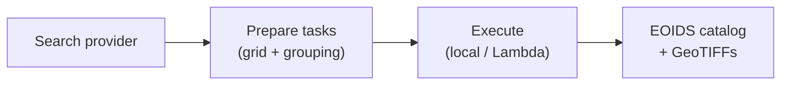

<div class="hero-banner" markdown>

</div>

# AEREO

**Plugin-based satellite data extraction — from search to analysis-ready Major TOM grid in minutes.**

AEREO unifies dozens of Earth-observation catalogs into one pipeline:
**search** across catalogs, **prepare** extraction tasks on a shared grid, and
**execute** them locally, from the CLI, or on AWS Lambda — all from plain
Python functions.

---

## Install

Pick your sensor and copy-paste:

=== "Sentinel-2 (Planetary Computer)"

    ```bash
    pip install aereo aereo-search-planetary-computer
    ```

=== "MODIS / VIIRS / Sentinel-3 (NASA Earthdata)"

    ```bash
    pip install aereo aereo-search-earthaccess
    ```

=== "GOES ABI (public S3)"

    ```bash
    pip install aereo aereo-search-aws-goes aereo-read-satpy aereo-reproject-satpy
    ```

> Install the core framework with `pip install aereo`. Search and I/O plugins
> are separate packages so you only ship what you need.

---

## 10-line example

```python
from datetime import datetime, timezone
from aereo.builtins import search_stac, build_grouped_tasks
from aereo.executors import LocalExecutor
from aereo.pipeline import ExtractionJob

# 1. Load the job (grid + read/write stages)
job = ExtractionJob.load_from_config("examples/config", config_name="job_sentinel2")

# 2. Search   3. Prepare tasks   4. Execute
assets = job.search(
    search_stac,
    stac_api_url="https://earth-search.aws.element84.com/v1",
    collections={"sentinel-2-l2a": ["red", "nir"]},
    intersects="examples/config/aoi/chocon.geojson",
    start_datetime=datetime(2024, 1, 1, tzinfo=timezone.utc),
    end_datetime=datetime(2024, 1, 10, tzinfo=timezone.utc),
)
tasks = job.build_tasks(assets, build_grouped_tasks, cells_per_task=5)
artifacts = job.execute(tasks, executor=LocalExecutor(workers=2))
```

Open `job.output_uri` — you have GeoTIFFs on the Major TOM grid.

---

## Why AEREO?

<div class="hero-grid" markdown>

-   ### Search anything

    One `job.search(...)` call works with STAC, Earthaccess, public S3, and
    custom catalogs. Swap the search function without changing your pipeline.

-   ### Grid aligned

    Outputs are indexed on the [Major TOM grid](user-guide/grids.md), so
    Sentinel-2, VIIRS, Sentinel-3, and GOES scenes stack together out of the
    box.

-   ### One config, three runtimes

    The same Hydra config package runs in a notebook, from the CLI, and on
    AWS Lambda.

-   ### Plain Python plugins

    No inheritance, no framework boilerplate. AEREO plugins are
    `@validate_call` functions registered via standard Python entry points.

</div>

---

## How it works



1. **Search** — query a catalog and get a validated `GeoDataFrame[AssetSchema]`.
2. **Prepare** — group assets by time and native CRS into `ExtractionTask`
   objects.
3. **Execute** — run each task through `read → preprocess → reproject →
   postprocess → write`, producing grid-aligned artifacts and a catalog.

---

## Next steps

<div class="hero-grid" markdown>

-   ### [Install](install.md)

    Set up AEREO and credentials for your first sensor.

-   ### [Your First Pipeline](getting-started/first-pipeline.md)

    Run a Sentinel-2 extraction from a Hydra config package.

-   ### [Tutorials](examples/index.md)

    Sentinel-2, VIIRS, Sentinel-3, Tessera, GOES-19, and NDVI/NDWI examples.

-   ### [Choosing a Sensor](user-guide/choosing-a-sensor.md)

    Pick the right search, read, and reproject plugins for your dataset.

</div>
