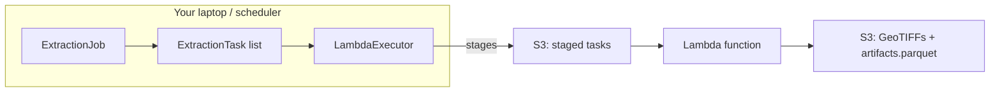

# Run on AWS Lambda

AerEO can run the same `ExtractionJob` on AWS Lambda by swapping the local
executor for `LambdaExecutor`. The pipeline does not change — only the place
where each `ExtractionTask` is executed.

## Why this is serverless



1. You still build the `ExtractionTask` list locally (or in a small launcher).
2. `LambdaExecutor` serialises each task to S3 and invokes one Lambda per task.
3. The Lambda runs the same `read → preprocess → reproject → postprocess → write`
   pipeline stored inside the task.
4. Results are uploaded back to `output_uri`, and the local process collects the
   artifact manifests.

Because the `ExtractionJob`, `ExtractionTask`, and stage functions travel with
the task, the Lambda handler does not need to discover plugins at runtime. You
can develop locally with `LocalExecutor`, then change one line to scale out on
Lambda.

## Swap the executor

Make sure the `serverless` extra is installed so that `boto3` is available:

```bash
uv add aereo[serverless]
# or
pip install aereo[serverless]
```

```python
from aereo.executors import LambdaExecutor
from aereo.pipeline import ExtractionJob

job = ExtractionJob.load_from_config("examples/config", config_name="job_sentinel2")
assets = job.search(...)
tasks = job.build_tasks(assets, build_grouped_tasks)

executor = LambdaExecutor(
    function_name="my-aereo-lambda",
    workers=10,
)
artifacts = job.execute(tasks, executor=executor)
job.write_catalog(artifacts)
```

That is the only code change.

## When to use Lambda

- Large extractions that need more parallelism than your laptop can provide.
- Production pipelines triggered on a schedule or by an event.
- Workloads where you do not want to manage a long-running cluster.

## Cost and tuning tips

- Start with `LocalExecutor` to estimate task runtime and output size.
- Use `cells_per_task` to balance the number of Lambda invocations against the
  work done per invocation.
- Match Lambda memory and timeout to the largest task in your job.
- Enable provisioned concurrency only if you run pipelines on a fixed schedule.

## Packaging

The Lambda function must have AerEO and the same pipeline plugins installed as
your local environment. Package it as a Docker image or a Lambda layer that
includes `aereo`, any sensor-specific plugins, and their dependencies. At
runtime the handler receives a staged task URI, runs the pipeline, and writes
results to the configured `output_uri`.

## Required permissions

The Lambda function needs:

- Read access to the catalog/search APIs you use.
- Write access to the `output_uri` (e.g. an S3 bucket).
- Enough memory and timeout for the largest task in your job.

---

Ready to add your own stage? Head to [Build a Plugin](../plugins/build-a-plugin.md).
