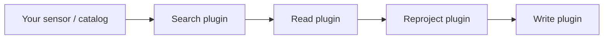

# Choosing a Sensor

AerEO separates the core framework from search and I/O plugins. The table below
shows a few common combinations, but it is not exhaustive: any constellation
works as long as you pair a search function with a compatible reader and
reprojector. The same `search_earthaccess` + `read_satpy` pair can read MODIS,
VIIRS, Sentinel-3, and many other NASA datasets; the same `search_stac` can hit
any STAC catalog. If your sensor is not listed, swap the plugin or write your
own — see [Build a Plugin](../plugins/build-a-plugin.md).

## Sensor cheat sheet

| Sensor | Install | Search | Read | Reproject | Notes |
|---|---|---|---|---|---|
| **Sentinel-2 MSI** | `uv add aereo` / `pip install aereo` | `search_stac` | `read_odc_stac` | `reproject_odc` | Easiest starting point; works with any STAC catalog. |
| **MODIS, VIIRS, Sentinel-3, etc.** | `uv add aereo aereo-read-satpy` / `pip install aereo aereo-read-satpy` | `search_earthaccess` | `read_satpy` | `reproject_swath` | NASA Earthdata login required. |
| **GOES ABI** | `uv add aereo aereo-search-aws-goes aereo-read-satpy` / `pip install ...` | `search_aws_goes` | `read_satpy` | `reproject_odc` | Public AWS S3, no auth. |
| **GeoTessera** | `uv add aereo aereo-search-tessera aereo-read-tessera` / `pip install ...` | `search_tessera` | `read_tessera` | — | Public data, no auth required. |

The install column is only a suggestion. If you already have a search function
that returns `AssetSchema`, you can reuse the built-in reader/reprojector; if
you have a custom reader, you can point any search function at it.

## When to use each search provider

- **`search_stac`** — any STAC catalog (Sentinel-2, Landsat, custom catalogs,
  etc.).
- **`search_earthaccess`** — NASA Earthdata collections accessible through
  [earthaccess](https://github.com/nsidc/earthaccess) (MODIS, VIIRS, Sentinel-3,
  etc.).
- **`search_aws_goes`** — GOES ABI data on the public AWS S3 bucket.
- **`search_tessera`** — GeoTessera tile catalogs.

## When to use each reader

- **`read_odc_stac`** — for STAC-backed, analysis-ready data cubes (Sentinel-2
  L2A, Landsat, etc.). Uses `odc-stac` and returns an `xr.Dataset` aligned to
  the asset's native geobox.
- **`read_satpy`** — for swath or Level-1b data that needs Satpy-style scene
  reading and resampling (MODIS, VIIRS, Sentinel-3, GOES, etc.).
- **`read_tessera`** — for GeoTessera tile catalogs.

## When to use each reprojector

- **`reproject_odc`** — reproject a raster `xr.Dataset` to a target CRS and
  resolution using `odc-geo`.
- **`reproject_swath`** — reproject 2-D lat/lon swaths to a UTM GeoBox using
  `odc-geo` and nearest-neighbor lookup. Use this for swath sensors such as
  VIIRS and Sentinel-3.

## Not listed? Mix and match

AerEO plugins are plain functions. To add a new constellation you usually only
need to answer two questions:

1. **How do I find the data?** Use an existing search provider, or write one
   that returns a `GeoDataFrame[AssetSchema]`.
2. **How do I open the data?** Use an existing reader, or write one that turns
   an `ExtractionTask` into an `xr.Dataset`.

If a reader already understands the file format, you can point a different
search provider at it. For example, `read_satpy` does not care whether the
assets came from `search_earthaccess`, `search_aws_goes`, or your own custom
search function — it only cares that the asset metadata describes a file Satpy
can open.

## Next steps

- Follow the tutorial for your sensor in the [Examples](../examples/index.md)
  section.
- Read the [Search](search.md) guide for collection and band naming tips.
- Learn how to configure plugins in the [Configuration](../configuration/config-package.md)
  section.
