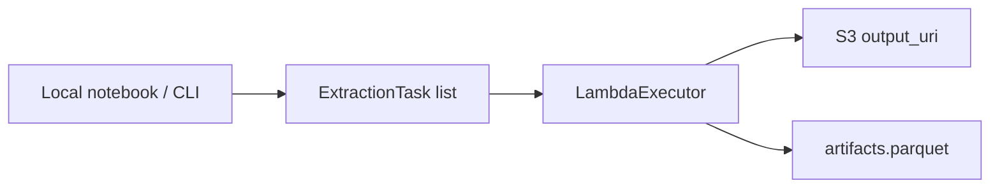

# AWS Lambda

AEREO can run the same `ExtractionJob` on AWS Lambda by swapping the local
executor for `LambdaExecutor`.

## When to use Lambda

- Large extractions that need more parallelism than your laptop can provide.
- Production pipelines triggered on a schedule or by an event.
- Workloads where you do not want to manage a long-running cluster.

## Overview



You still build the tasks locally (or in a small launcher). Each task is then
serialized and sent to a Lambda function that runs the same `read → preprocess
→ reproject → postprocess → write` pipeline.

## Quick example

```python
from aereo.executors import LambdaExecutor
from aereo.pipeline import ExtractionJob

job = ExtractionJob.load_from_config("examples/config", config_name="job_sentinel2")
assets = job.search(...)
tasks = job.build_tasks(assets, build_grouped_tasks)

executor = LambdaExecutor(
    function_name="aereo-extract",
    workers=10,
)
artifacts = job.execute(tasks, executor=executor)
job.write_catalog(artifacts)
```

## Packaging

Use the `aereo-extract` base project to scaffold a Lambda-ready Docker image:

```bash
aereo-extract init-docker my-lambda
```

This creates a project with the necessary handler entry point and deployment
helpers.

## Required permissions

The Lambda function needs:

- Read access to the catalog/search APIs you use.
- Write access to the `output_uri` (e.g. an S3 bucket).
- Enough memory and timeout for the largest task in your job.

## Cost tips

- Start with `LocalExecutor` to estimate task runtime and output size.
- Use `cells_per_task` to balance the number of Lambda invocations against the
  work done per invocation.
- Enable Lambda provisioned concurrency only if you run pipelines on a fixed
  schedule.
