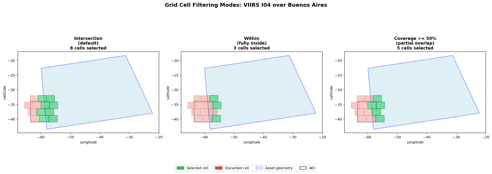
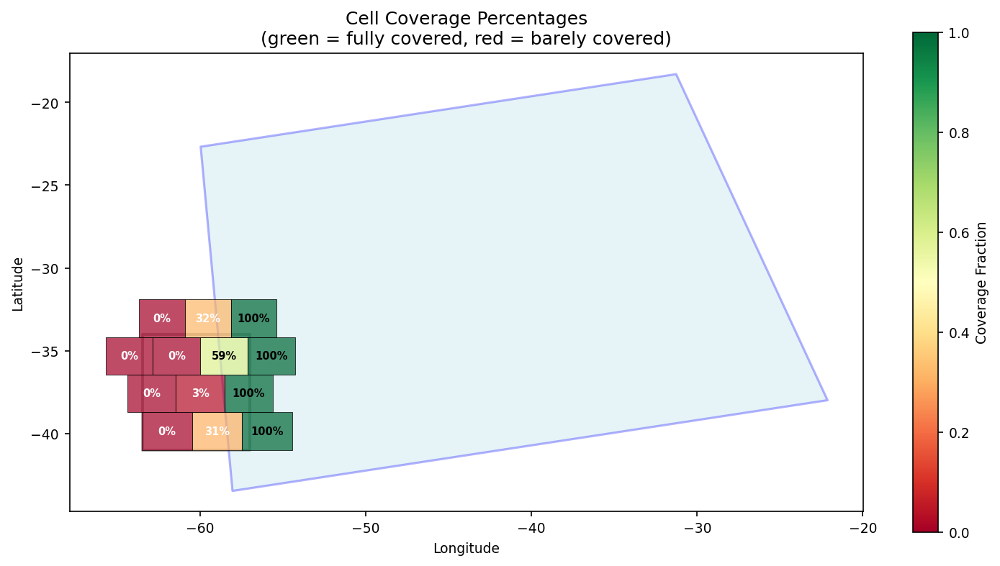
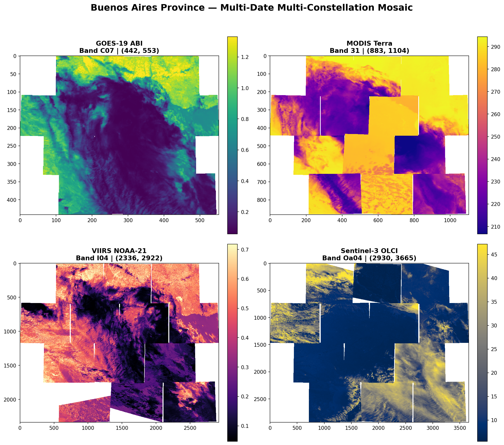

# AER Examples

This directory contains example notebooks, datasets, and visualizations demonstrating the AER (Asset Extraction and Retrieval) framework for satellite data processing.

---

## Directory Structure

```
examples/
├── extraction/         # Data extraction notebooks by sensor
├── grid/             # Grid system and filtering demonstrations
├── visualization/    # Multi-sensor visualization examples
├── *.geojson         # Sample AOIs (Buenos Aires, Cordoba, Bari, etc.)
└── extract_*/        # Extracted output directories (auto-generated)
```

---

## Extraction Examples (`extraction/`)

Notebooks demonstrating how to search and extract data from different satellite sensors:

| Notebook | Sensor | Description |
|----------|--------|-------------|
| `goes_abi_extraction.ipynb` | GOES-16 ABI | Full-disk geostationary imagery |
| `modis_terra_extraction.ipynb` | MODIS Terra | Global daily coverage, 250m-1km |
| `sentinel2_msi_extraction.ipynb` | Sentinel-2 MSI | 10m resolution optical imagery |
| `sentinel3_olci_extraction.ipynb` | Sentinel-3 OLCI | Ocean and land color instrument |
| `viirs_extraction.ipynb` | VIIRS (NOAA-21) | Day/night band and thermal imagery |

Each notebook follows the same pattern:
1. **Search**: Find granules intersecting an AOI for a date range
2. **Prepare**: Generate grid cells and create extraction tasks
3. **Extract**: Download and process raw data into GeoTIFFs
4. **Output**: Organized by `location/date/satellite/product/band/resolution`

---

## Grid Filtering (`grid/`)

### Grid Cell Filtering Modes

When preparing extraction tasks, grid cells can be filtered based on their relationship to the asset geometry (the actual satellite swath footprint, not just its bounding box). This prevents extracting near-empty cells that only have valid data for a small fraction of their area.

#### The Problem

By default, AER uses **intersection** filtering: any grid cell that touches the asset geometry is selected. This can lead to cells that are 95% empty (NaN) because the satellite swath only grazes the corner of the cell.

#### Three Filter Modes

| Mode | Parameter | Behavior | Use Case |
|------|-----------|----------|----------|
| **Intersection** | `grid_filter_mode='intersection'` (default) | Cell touches asset geometry at any point | Maximize coverage, accept partial cells |
| **Within** | `grid_filter_mode='within'` | Cell is fully contained inside asset geometry | Only fully valid cells, minimize edge effects |
| **Coverage** | `grid_filter_mode='coverage'` + `min_coverage=0.5` | Cell has ≥X% of its area inside asset geometry | Balanced approach, configurable threshold |

#### Visual Comparison

Using a real VIIRS granule over Buenos Aires (13 grid cells total):

**Side-by-side comparison of all three modes:**



- **Green cells**: Selected for extraction
- **Red cells**: Discarded by the filter
- **Light blue**: Asset geometry (actual satellite swath footprint)
- **Black outline**: Area of Interest (AOI)

**Coverage percentages for each cell:**



This heatmap shows the exact coverage percentage of each cell. Cells near the boundary may have only 10-30% valid data, while central cells are 100% covered.

#### Results for Buenos Aires VIIRS Example

| Filter Mode | Cells Selected | Cells Discarded | Description |
|-------------|---------------|-----------------|-------------|
| `intersection` | 8 | 5 | Default. Includes cells barely touched by swath |
| `within` | 3 | 10 | Conservative. Only fully contained cells |
| `coverage >= 50%` | 5 | 8 | Balanced. Requires meaningful overlap |

#### Usage

```python
client.prepare_for_extraction(
    search_results=results,
    profiles=profiles,
    uri="/tmp/output",
    prepare_params={
        "grid_filter_mode": "coverage",   # or "intersection", "within"
        "min_coverage": 0.5,               # 0.0 to 1.0, only for "coverage" mode
        "cells_per_chunk": 10,
    },
)
```

#### Notebook

See `grid/grid_filter_modes_demo.ipynb` for the full demonstration with interactive code.

---

## Visualization Examples (`visualization/`)

| Notebook | Description |
|----------|-------------|
| `multi_constellation_visualization.ipynb` | Compare multiple sensors (GOES, MODIS, Sentinel-2, Sentinel-3, VIIRS) in a single view |

**Output example:**

- `multi_date_mosaic_fixed.png` — Time-series mosaic composite



---

## Sample AOIs

| File | Region | Coordinates (approx) |
|------|--------|---------------------|
| `buenos_aires.geojson` | Buenos Aires province, Argentina | -63.5,-41 to -57,-34 |
| `cordoba.geojson` | Cordoba province, Argentina | -65.5,-33 to -62,-29 |
| `bari.geojson` | Bari, Italy | 16.5,40.8 to 17.5,41.2 |
| `test_aoi.geojson` | Small test polygon | Minimal bounding box |

---

## Extracted Data Directories

Directories named `extract_*` contain actual extraction outputs organized as:

```
extract_buenos_aires_viirs/
├── loc-15D21L/
│   └── date-20260401/
│       └── sat-NOAA21/
│           └── loc-15D21L_start-..._band-I04_res-400m.tif
├── VJ202IMG.A2026091.1818.021...nc   # Source granule
└── ...
```

These are generated by running the extraction notebooks and are **not** tracked in git.

---

## Running the Examples

All notebooks use the AER virtual environment at `/root/repos/aer/.venv`:

```bash
cd /root/repos/aer
.venv/bin/jupyter notebook examples/
```

Or convert to script and run:

```bash
cd /root/repos/aer/examples/extraction
.venv/bin/jupyter nbconvert --to script viirs_extraction.ipynb
.venv/bin/python viirs_extraction.py
```

---

## Requirements

The examples assume:
- AER framework installed (`/root/repos/aer`)
- Earthdata authentication (for NASA datasets: MODIS, VIIRS)
- Sufficient disk space for satellite granules (500MB-2GB per sensor)

---

## Notes

- **Grid cell size**: Default is 256km (`target_grid_dist=256000`). Adjust based on sensor resolution and AOI size.
- **Padding**: Default 2 pixels. Increases extracted area slightly to avoid edge artifacts.
- **Resampling**: Default `nearest`. Alternatives: `bilinear`, `native`.
- **Workers**: `max_batch_workers=2` for parallel extraction. Set to `None` for sequential (safer for memory).
